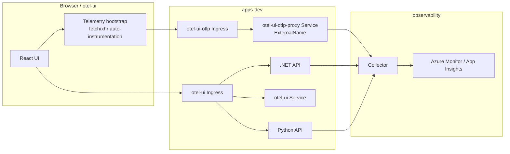

# OTel Development Deployment

[中文入口](../README.md) | [English Home](../README.en.md) | [中文文档名](README.dev.md)

## Files

- otel-gateway-myvalues.yaml: primary Collector values for development (single-collector).
- inst-crd-dotnet.yaml: .NET auto-instrumentation CRD.
- inst-crd-python.yaml: Python auto-instrumentation CRD.
- otelapidemo-dotnet.yaml: .NET sample app manifest.
- otelapidemo-python.yaml: Python sample app manifest.
- otel-ui.yaml: React UI deployment manifest.
- otelapidemo-ingress.yaml: API ingress for `/dotnet/*` and `/python/*`.
- otel-ui-ingress.yaml: UI ingress for `/`.
- otel-ui-otlp-ingress.yaml: same-origin OTLP ingress for `/otlp/*`, forwarded to Collector 4318.
- otel-ui-otlp-service.yaml: same-namespace OTLP proxy Service (ExternalName, pointing to the Collector in `observability`).
- certmgr-test.yaml: cert-manager test manifest for development validation.
- README.dev.md: Chinese development deployment guide.
- README.dev.en.md: this English development deployment guide.

## Architecture Diagram



Browser OTLP uses the same-namespace `otel-ui-otlp-proxy` Service to reach the Collector in `observability`, which keeps the browser endpoint same-origin while respecting Kubernetes ingress scoping.

## Prerequisites

1. Access to AKS cluster with kubectl and helm configured.
2. Namespace observability exists.
3. Application namespace exists (example: apps-dev).
4. If you use a private registry image for auto-instrumentation, configure imagePullSecrets in the application namespace.

## Deploy Order

1. Create and label application namespace.
2. Install or upgrade OpenTelemetry Operator and verify it is healthy.
3. Check whether `connection_string` in `otel-gateway-myvalues.yaml` is still a placeholder, and replace it with a real value first.
4. Apply the RBAC required for the collector to read Kubernetes metadata.
5. Deploy or upgrade single collector (development mode).
6. Apply Instrumentation CRDs.
7. Check whether `<ACR_LOGIN_SERVER>` in the application manifests is still a placeholder, and replace it with a real value first.
8. Deploy the `.NET`, Python, and React UI sample applications.
9. Get the UI ingress address and validate `/`, `/dotnet/*`, and `/python/*` through the shared public entrypoint.
10. Run a short load test against both the .NET and Python sample apps to generate traces, logs, and metrics.
11. Verify collector pipeline counters, Kubernetes resource attributes, and telemetry ingestion.

## Commands (bash)

```bash
# 1) Create and label app namespace
kubectl create namespace apps-dev --dry-run=client -o yaml | kubectl apply -f -
kubectl label namespace apps-dev otel-client=true --overwrite

# 2) Install or upgrade OpenTelemetry Operator (release name: opentelemetry-operator)
helm upgrade --install opentelemetry-operator open-telemetry/opentelemetry-operator \
  -n opentelemetry-operator-system --create-namespace
kubectl get pods -n opentelemetry-operator-system

# 3) Check whether connection_string is still a placeholder; replace it before deployment if prompted
grep -q 'connection_string: "<APP_INSIGHTS_CONNECTION_STRING>"' ./dev/otel-gateway-myvalues.yaml && echo "Replace <APP_INSIGHTS_CONNECTION_STRING> in ./dev/otel-gateway-myvalues.yaml before deployment" || echo "connection_string looks set"

# 4) Apply RBAC required by k8sattributes
kubectl apply -f ./dev/otel-collector-k8sattributes-rbac.yaml

# 5) Deploy single collector (release name: otel-collector)
helm upgrade --install otel-collector open-telemetry/opentelemetry-collector \
  -n observability --create-namespace \
  -f ./dev/otel-gateway-myvalues.yaml

# 6) Apply Instrumentation CRDs
kubectl apply -f ./dev/inst-crd-dotnet.yaml
kubectl apply -f ./dev/inst-crd-python.yaml

# 7) Inject ACR and deploy sample apps through the deployment script (recommended)
export ACR_LOGIN_SERVER="myacr.azurecr.io"
./dev/deploy-apps.sh

# 8) Get the unified ingress address and validate the shared entrypoint
ingress_host=$(kubectl get ingress -n apps-dev otel-ui -o jsonpath='{.status.loadBalancer.ingress[0].ip}')
if [ -z "$ingress_host" ]; then
  ingress_host=$(kubectl get ingress -n apps-dev otel-ui -o jsonpath='{.status.loadBalancer.ingress[0].hostname}')
fi
curl -fsS "http://${ingress_host}/" > /dev/null
curl -fsS "http://${ingress_host}/dotnet/weatherforecast" > /dev/null
curl -fsS "http://${ingress_host}/python/weatherforecast" > /dev/null

# 9) Run a short load test (first target the .NET sample app)
seq 1 200 | xargs -I{} -P 20 curl -fsS "http://${ingress_host}/dotnet/weatherforecast" > /dev/null

# 9b) Run the same load test against the Python sample app
seq 1 200 | xargs -I{} -P 20 curl -fsS "http://${ingress_host}/python/weatherforecast" > /dev/null

# 9c) Exception endpoint stress test (recommended, covers both .NET and Python; expected HTTP 500)
req=100
conc=20
timeout=8

dotnet_exception_url="http://${ingress_host}/dotnet/WeatherForecast/throw-custom-exception"
python_exception_url="http://${ingress_host}/python/throw-custom-exception"

echo "[dotnet exception] ${dotnet_exception_url}"
seq 1 "$req" | xargs -P "$conc" -I{} sh -c 'curl -L -sS -o /dev/null -w "%{http_code}\n" --max-time "$1" "$2" || echo 000' _ "$timeout" "$dotnet_exception_url" |
  sort | uniq -c

echo "[python exception] ${python_exception_url}"
seq 1 "$req" | xargs -P "$conc" -I{} sh -c 'curl -L -sS -o /dev/null -w "%{http_code}\n" --max-time "$1" "$2" || echo 000' _ "$timeout" "$python_exception_url" |
  sort | uniq -c

# 9d) New endpoint stress test (throw-and-catch-exception, covers both .NET and Python; expected HTTP 200)
dotnet_handled_exception_url="http://${ingress_host}/dotnet/WeatherForecast/throw-and-catch-exception"
python_handled_exception_url="http://${ingress_host}/python/throw-and-catch-exception"

echo "[dotnet handled exception] ${dotnet_handled_exception_url}"
seq 1 "$req" | xargs -P "$conc" -I{} sh -c 'curl -L -sS -o /dev/null -w "%{http_code}\n" --max-time "$1" "$2" || echo 000' _ "$timeout" "$dotnet_handled_exception_url" |
  sort | uniq -c

echo "[python handled exception] ${python_handled_exception_url}"
seq 1 "$req" | xargs -P "$conc" -I{} sh -c 'curl -L -sS -o /dev/null -w "%{http_code}\n" --max-time "$1" "$2" || echo 000' _ "$timeout" "$python_handled_exception_url" |
  sort | uniq -c

# 10) Verify basic status
kubectl get pods -n observability
kubectl get deploy -n observability
kubectl get instrumentation -n observability
kubectl get deploy,svc,ingress -n apps-dev

# 11) Collector pipeline counters (single collector)
pod=$(kubectl get pods -n observability -l app.kubernetes.io/instance=otel-collector -o jsonpath='{.items[0].metadata.name}')
kubectl get --raw "/api/v1/namespaces/observability/pods/${pod}:8888/proxy/metrics" |
  grep -E "otelcol_receiver_accepted_spans|otelcol_exporter_sent_spans|otelcol_receiver_accepted_log_records|otelcol_exporter_sent_log_records|otelcol_receiver_accepted_metric_points|otelcol_exporter_sent_metric_points"
```

## Commands (PowerShell)

```powershell
# 1) Create and label app namespace
kubectl create namespace apps-dev --dry-run=client -o yaml | kubectl apply -f -
kubectl label namespace apps-dev otel-client=true --overwrite

# 2) Install or upgrade OpenTelemetry Operator (release name: opentelemetry-operator)
helm upgrade --install opentelemetry-operator open-telemetry/opentelemetry-operator `
  -n opentelemetry-operator-system --create-namespace
kubectl get pods -n opentelemetry-operator-system

# 3) Check whether connection_string is still a placeholder; replace it before deployment if prompted
if (Select-String -Path ./dev/otel-gateway-myvalues.yaml -Pattern 'connection_string:\s*"<APP_INSIGHTS_CONNECTION_STRING>"' -Quiet) { Write-Host "Replace <APP_INSIGHTS_CONNECTION_STRING> in ./dev/otel-gateway-myvalues.yaml before deployment" } else { Write-Host "connection_string looks set" }

# 4) Apply RBAC required by k8sattributes
kubectl apply -f ./dev/otel-collector-k8sattributes-rbac.yaml

# 5) Deploy single collector (release name: otel-collector)
helm upgrade --install otel-collector open-telemetry/opentelemetry-collector `
  -n observability --create-namespace `
  -f ./dev/otel-gateway-myvalues.yaml

# 6) Apply Instrumentation CRDs
kubectl apply -f ./dev/inst-crd-dotnet.yaml
kubectl apply -f ./dev/inst-crd-python.yaml

# 7) Inject ACR and deploy sample apps through the deployment script (recommended)
$env:ACR_LOGIN_SERVER = "myacr.azurecr.io"
./dev/deploy-apps.ps1

# 8) Get the unified ingress address and validate the shared entrypoint
$ingressHost = kubectl get ingress -n apps-dev otel-ui -o jsonpath='{.status.loadBalancer.ingress[0].ip}'
if ([string]::IsNullOrWhiteSpace($ingressHost)) {
  $ingressHost = kubectl get ingress -n apps-dev otel-ui -o jsonpath='{.status.loadBalancer.ingress[0].hostname}'
}
Invoke-WebRequest -Uri "http://${ingressHost}/" -UseBasicParsing | Out-Null
Invoke-WebRequest -Uri "http://${ingressHost}/dotnet/weatherforecast" -UseBasicParsing | Out-Null
Invoke-WebRequest -Uri "http://${ingressHost}/python/weatherforecast" -UseBasicParsing | Out-Null

# 9) Run a short load test (first target the .NET sample app)
1..200 | ForEach-Object { Invoke-WebRequest -Uri "http://${ingressHost}/dotnet/weatherforecast" -UseBasicParsing | Out-Null }

# 9b) Run the same load test against the Python sample app
1..200 | ForEach-Object { Invoke-WebRequest -Uri "http://${ingressHost}/python/weatherforecast" -UseBasicParsing | Out-Null }

# 9c) Exception endpoint stress test (recommended, covers both .NET and Python; expected HTTP 500)
$req = 100
$conc = 20
$timeoutSec = 8

$dotnetExceptionUrl = "http://${ingressHost}/dotnet/WeatherForecast/throw-custom-exception"
$pythonExceptionUrl = "http://${ingressHost}/python/throw-custom-exception"

Write-Host "[dotnet exception] $dotnetExceptionUrl"
$dotnetCodes = 1..$req | ForEach-Object -Parallel {
  $status = & curl.exe -L -sS -o NUL -w "%{http_code}" --max-time $using:timeoutSec $using:dotnetExceptionUrl
  if ([string]::IsNullOrWhiteSpace($status)) { "000" } else { $status.Trim() }
} -ThrottleLimit $conc
$dotnetCodes | Group-Object | Sort-Object Name | Format-Table Name, Count -AutoSize

Write-Host "[python exception] $pythonExceptionUrl"
$pythonCodes = 1..$req | ForEach-Object -Parallel {
  $status = & curl.exe -L -sS -o NUL -w "%{http_code}" --max-time $using:timeoutSec $using:pythonExceptionUrl
  if ([string]::IsNullOrWhiteSpace($status)) { "000" } else { $status.Trim() }
} -ThrottleLimit $conc
$pythonCodes | Group-Object | Sort-Object Name | Format-Table Name, Count -AutoSize

# 9d) New endpoint stress test (throw-and-catch-exception, covers both .NET and Python; expected HTTP 200)
$dotnetHandledExceptionUrl = "http://${ingressHost}/dotnet/WeatherForecast/throw-and-catch-exception"
$pythonHandledExceptionUrl = "http://${ingressHost}/python/throw-and-catch-exception"

Write-Host "[dotnet handled exception] $dotnetHandledExceptionUrl"
$dotnetHandledCodes = 1..$req | ForEach-Object -Parallel {
  $status = & curl.exe -L -sS -o NUL -w "%{http_code}" --max-time $using:timeoutSec $using:dotnetHandledExceptionUrl
  if ([string]::IsNullOrWhiteSpace($status)) { "000" } else { $status.Trim() }
} -ThrottleLimit $conc
$dotnetHandledCodes | Group-Object | Sort-Object Name | Format-Table Name, Count -AutoSize

Write-Host "[python handled exception] $pythonHandledExceptionUrl"
$pythonHandledCodes = 1..$req | ForEach-Object -Parallel {
  $status = & curl.exe -L -sS -o NUL -w "%{http_code}" --max-time $using:timeoutSec $using:pythonHandledExceptionUrl
  if ([string]::IsNullOrWhiteSpace($status)) { "000" } else { $status.Trim() }
} -ThrottleLimit $conc
$pythonHandledCodes | Group-Object | Sort-Object Name | Format-Table Name, Count -AutoSize

# 10) Verify basic status
kubectl get pods -n observability
kubectl get deploy -n observability
kubectl get instrumentation -n observability
kubectl get deploy,svc,ingress -n apps-dev

# 11) Collector pipeline counters (single collector)
$pod = kubectl get pods -n observability -l app.kubernetes.io/instance=otel-collector -o jsonpath='{.items[0].metadata.name}'
kubectl get --raw "/api/v1/namespaces/observability/pods/${pod}:8888/proxy/metrics" |
  Select-String -Pattern "otelcol_receiver_accepted_spans|otelcol_exporter_sent_spans|otelcol_receiver_accepted_log_records|otelcol_exporter_sent_log_records|otelcol_receiver_accepted_metric_points|otelcol_exporter_sent_metric_points"

# 12) Verify whether file_log receiver is working (container log collection)
$pod = kubectl get pods -n observability -l app.kubernetes.io/instance=otel-collector -o jsonpath='{.items[0].metadata.name}'

# 12.1 Confirm file_log receiver is loaded in startup/runtime logs
kubectl logs -n observability $pod --tail=200 |
  Select-String -Pattern "file_log|stanza"

# 12.2 Check file_log receiver counters from collector self-metrics
kubectl get --raw "/api/v1/namespaces/observability/pods/${pod}:8888/proxy/metrics" |
  Select-String -Pattern 'otelcol_receiver_accepted_log_records.*receiver="file_log"|otelcol_receiver_refused_log_records.*receiver="file_log"'

# 12.3 Inspect K8s container-log metadata in collected records (sample)
kubectl logs -n observability $pod --tail=200 |
  Select-String -Pattern "k8s.container.name|k8s.pod.name|k8s.namespace.name"
```

## Annotation Examples

```yaml
metadata:
  annotations:
    instrumentation.opentelemetry.io/inject-dotnet: "observability/dotnet-auto"
```

```yaml
metadata:
  annotations:
    instrumentation.opentelemetry.io/inject-python: "observability/python-auto"
```

## Notes

- This development baseline uses a single collector deployment.
- Current dev values include debug and azuremonitor exporters for troubleshooting.
- The current dev collector enables the `k8sattributes` processor to append `k8s.*` resource attributes automatically, while application-side `OTEL_RESOURCE_ATTRIBUTES` continues to hold static labels such as environment.
- The current dev collector enables the `file_log` receiver to collect container log files from nodes (`/var/log/pods/.../*.log`).
- Development now exposes a unified ingress entrypoint: `/` serves the React UI, `/dotnet/*` routes to the .NET API, and `/python/*` routes to the Python API.
- `dev/deploy-apps.ps1` and `dev/deploy-apps.sh` deploy the `.NET`, Python, and React UI apps together with both ingress resources.
- Current development image baseline: `.NET`=`1.0.4`, Python=`1.0.4`, UI=`1.0.1`.
- The load-test commands now cover both the .NET and Python sample apps on the `/weatherforecast` endpoint through the ingress entrypoint.
- Exception endpoint stress-test commands are inlined in steps 9c and 9d: `throw-custom-exception` is expected to return HTTP 500, and `throw-and-catch-exception` is expected to return HTTP 200.
- If Python public endpoint tests return mixed 302/200 results and headers show an external redirect target, that redirect is typically injected by the public network path, not returned by application code or AKS pods.
- This class of public redirect cannot be "disabled" in application code; mitigation is network-side governance (enterprise/ISP allowlisting, false-positive appeal) or exposure-path redesign.
- Recommended exposure is ClusterIP services behind Ingress + domain + HTTPS, instead of direct bare public IP access.
- For diagnosis, verify real app behavior from inside the cluster first: `kubectl run curl-check --rm -i --restart=Never --image=curlimages/curl:8.11.1 -n apps-dev -- sh -c "curl -s -o /dev/null -w 'dotnet-throw:%{http_code}\n' http://otelapidemo.apps-dev.svc.cluster.local/WeatherForecast/throw-custom-exception; curl -s -o /dev/null -w 'python-throw:%{http_code}\n' http://otelapidemo-python.apps-dev.svc.cluster.local/throw-custom-exception; curl -s -o /dev/null -w 'dotnet-catch:%{http_code}\n' http://otelapidemo.apps-dev.svc.cluster.local/WeatherForecast/throw-and-catch-exception; curl -s -o /dev/null -w 'python-catch:%{http_code}\n' http://otelapidemo-python.apps-dev.svc.cluster.local/throw-and-catch-exception"`.
- If logs are not visible in Azure Monitor, first verify app-side log generation and collector sent/failed counters.
- Development uses `otel-gateway-myvalues.yaml` as the only default Collector values entrypoint.
- Image fields in `otelapidemo-*.yaml` use the `<ACR_LOGIN_SERVER>` placeholder; use `./dev/deploy-apps.ps1` or `./dev/deploy-apps.sh` to inject the real ACR during deployment, and do not write it back into committed manifests.
- `otelapidemo-python.yaml` is currently an example template only and has not completed full validation; validate in an isolated environment before enabling.
- For better CRD reuse, keep service-specific OTEL_SERVICE_NAME in application Deployment, not in shared Instrumentation CRD.

## KQL Validation

The following examples assume the Application Insights-compatible `traces` table with the `timestamp` column. If your environment uses workspace-based tables, replace `traces` with `AppTraces` and `timestamp` with `TimeGenerated`.

```kusto
// 1) Check whether k8s resource attributes are present in the last hour
traces
| where timestamp > ago(1h)
| extend
  service = tostring(customDimensions["service.name"]),
  ns = tostring(customDimensions["k8s.namespace.name"]),
  pod = tostring(customDimensions["k8s.pod.name"]),
  deployment = tostring(customDimensions["k8s.deployment.name"]),
  node = tostring(customDimensions["k8s.node.name"])
| where isnotempty(ns) or isnotempty(pod) or isnotempty(deployment) or isnotempty(node)
| project timestamp, service, ns, pod, deployment, node, message
| order by timestamp desc
| take 50
```

```kusto
// 2) Count which k8s fields already have values
traces
| where timestamp > ago(1h)
| summarize
  ns_count = countif(isnotempty(tostring(customDimensions["k8s.namespace.name"]))),
  pod_count = countif(isnotempty(tostring(customDimensions["k8s.pod.name"]))),
  deployment_count = countif(isnotempty(tostring(customDimensions["k8s.deployment.name"]))),
  container_count = countif(isnotempty(tostring(customDimensions["k8s.container.name"]))),
  node_count = countif(isnotempty(tostring(customDimensions["k8s.node.name"])))
```

```kusto
// 3) Check k8s metadata coverage by service
traces
| where timestamp > ago(1h)
| extend
  service = tostring(customDimensions["service.name"]),
  ns = tostring(customDimensions["k8s.namespace.name"]),
  pod = tostring(customDimensions["k8s.pod.name"])
| summarize
  total = count(),
  with_ns = countif(isnotempty(ns)),
  with_pod = countif(isnotempty(pod))
  by service
| order by total desc
```

```kusto
// 4) Confirm that the development environment label is dev
traces
| where timestamp > ago(1h)
| extend
  service = tostring(customDimensions["service.name"]),
  env = tostring(customDimensions["deployment.environment.name"])
| summarize count() by service, env
| order by count_ desc
```

```kusto
// 5) Query exceptions in the last hour (dev)
exceptions
| where timestamp > ago(1h)
| where cloud_RoleName has "apps-dev"
  or tostring(customDimensions["service.namespace"]) =~ "apps-dev"
| project timestamp, cloud_RoleName, type, outerMessage, problemId, operation_Id
| order by timestamp desc
```

```kusto
// 6) Correlate exception-endpoint requests with exception records (dev)
let Ex = exceptions
| where timestamp > ago(1h)
| project exTime=timestamp, operation_Id, exType=type, exMsg=outerMessage, exRole=cloud_RoleName;
requests
| where timestamp > ago(1h)
| where url has "throw-custom-exception" or url has "throw-and-catch-exception"
| where cloud_RoleName has "apps-dev"
  or tostring(customDimensions["service.namespace"]) =~ "apps-dev"
| project reqTime=timestamp, operation_Id, reqRole=cloud_RoleName, name, url, resultCode, success
| join kind=leftouter Ex on operation_Id
| order by reqTime desc
```
