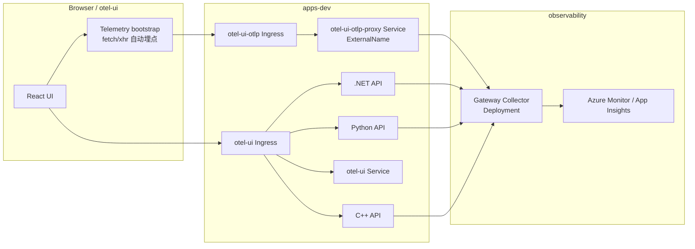

# OTel 开发部署

[中文首页](../README.md) | [English Home](../README.en.md) | [English Doc](README.dev.en.md)

## 文件清单

- otel-gateway-myvalues.yaml：当前开发主用的 Gateway Collector values（Deployment 模式）。
- inst-crd-dotnet.yaml：.NET 自动注入 Instrumentation CRD。
- inst-crd-python.yaml：Python 自动注入 Instrumentation CRD。
- otelapidemo-dotnet.yaml：.NET 示例应用部署清单。
- otelapidemo-python.yaml：Python 示例应用部署清单。
- otel-ui.yaml：React UI 部署清单。
- otelapidemo-ingress.yaml：API 路由 Ingress（`/dotnet/*`、`/python/*`、`/cpp/*`）。
- otel-ui-ingress.yaml：UI 根路径 Ingress（`/`）。
- otel-ui-otlp-ingress.yaml：UI 同源 OTLP 入口（`/otlp/*`，转发到 Collector 4318）。
- otel-ui-otlp-service.yaml：同 namespace OTLP 代理 Service（ExternalName，指向 `observability` 中的 Collector）。
- ingress-security-template.dev.yaml：Ingress 安全模板（限流 + 常见扫描路径拦截）。
- certmgr-test.yaml：cert-manager 功能测试清单（开发验证用途）。
- release-notes.dev.md：开发环境发布记录（版本变更与部署结果）。
- README.dev.md：当前中文开发部署说明。
- README.dev.en.md：英文开发部署说明。

## 架构图



说明：浏览器端 OTLP 通过同 namespace 的 `otel-ui-otlp-proxy` 代理 Service 转发到 `observability` 命名空间里的 Gateway Collector（Deployment），这样既满足 Ingress backend 的作用域限制，也保持了同源 `/otlp/*` 入口。

## 前置条件

1. 已具备 AKS 集群访问权限，并已正确配置 kubectl 与 helm。
2. `observability` 命名空间已存在。
3. 应用命名空间已存在（示例：`apps-dev`）。
4. 若自动注入镜像使用私有仓库，请在应用命名空间配置 imagePullSecrets。

## 部署顺序

1. 创建并标记应用命名空间。
2. 安装或升级 OpenTelemetry Operator，并确认状态正常。
3. 检查 `otel-gateway-myvalues.yaml` 中的 `connection_string` 是否仍为占位符，并先替换为真实值。
4. 应用 Collector 读取 Kubernetes 元数据所需的 RBAC。
5. 部署或升级 Gateway Collector（Deployment，开发模式）。
6. 应用 Instrumentation CRD。
7. 检查应用清单中的 `<ACR_LOGIN_SERVER>` 是否仍为占位符，并先替换为真实值。
8. 部署 `.NET`、Python 与 React UI 示例应用。
9. 获取 UI Ingress 地址，并通过统一入口验证 `/`、`/dotnet/*`、`/python/*`、`/cpp/*`，同时确认 `/otlp/v1/traces` 通过 `otel-ui-otlp-proxy` 正常转发。
10. 分别对 `.NET`、Python 与 C++ 示例应用进行一轮压力测试，触发 traces、logs 与 metrics。
11. 验证 Collector 管道计数器、Kubernetes 资源属性与遥测上报。

## Ingress 安全模板（可选）

当公网出现大量 `.php`、`.jsp`、`javax.faces` 等扫描流量时，可按需应用模板：

```bash
kubectl apply -f ./dev/ingress-security-template.dev.yaml
```

说明：

- 模板默认包含 NGINX 限流注解（`limit-rps`、`limit-rpm`、`limit-connections`）。
- 模板中的 `server-snippet` 用于拦截常见扫描路径；若集群未开启 `allow-snippet-annotations=true`，请先移除该段再应用。

## 命令（bash）

```bash
# 1) 创建并标记应用命名空间
kubectl create namespace apps-dev --dry-run=client -o yaml | kubectl apply -f -
kubectl label namespace apps-dev otel-client=true --overwrite

# 2) 安装或升级 OpenTelemetry Operator（release 名称：opentelemetry-operator）
helm upgrade --install opentelemetry-operator open-telemetry/opentelemetry-operator \
  -n opentelemetry-operator-system --create-namespace
kubectl get pods -n opentelemetry-operator-system

# 3) 检查 connection_string 是否仍为占位符；如果输出提示，请先替换后再部署
grep -q 'connection_string: "<APP_INSIGHTS_CONNECTION_STRING>"' ./dev/otel-gateway-myvalues.yaml && echo "请先将 ./dev/otel-gateway-myvalues.yaml 中的 <APP_INSIGHTS_CONNECTION_STRING> 替换为真实值" || echo "connection_string 已设置"

# 4) 应用 k8sattributes 所需 RBAC
kubectl apply -f ./dev/otel-collector-k8sattributes-rbac.yaml

# 5) 部署 Gateway Collector（Deployment，release 名称：otel-collector）
helm upgrade --install otel-collector open-telemetry/opentelemetry-collector \
  -n observability --create-namespace \
  -f ./dev/otel-gateway-myvalues.yaml

# 6) 应用 Instrumentation CRD
kubectl apply -f ./dev/inst-crd-dotnet.yaml
kubectl apply -f ./dev/inst-crd-python.yaml

# 7) 通过部署脚本注入 ACR 并部署示例应用（推荐）
export ACR_LOGIN_SERVER="myacr.azurecr.io"
./dev/deploy-apps.sh

# 8) 获取统一入口地址并做基础连通性验证
ingress_host=$(kubectl get ingress -n apps-dev otel-ui -o jsonpath='{.status.loadBalancer.ingress[0].ip}')
if [ -z "$ingress_host" ]; then
  ingress_host=$(kubectl get ingress -n apps-dev otel-ui -o jsonpath='{.status.loadBalancer.ingress[0].hostname}')
fi
curl -fsS "http://${ingress_host}/" > /dev/null
curl -fsS "http://${ingress_host}/dotnet/weatherforecast" > /dev/null
curl -fsS "http://${ingress_host}/python/weatherforecast" > /dev/null
curl -fsS "http://${ingress_host}/cpp/weatherforecast" > /dev/null

# 9) 进行一轮压力测试（先测 .NET 示例应用）
seq 1 200 | xargs -I{} -P 20 curl -fsS "http://${ingress_host}/dotnet/weatherforecast" > /dev/null

# 9b) 对 Python 示例应用进行压力测试
seq 1 200 | xargs -I{} -P 20 curl -fsS "http://${ingress_host}/python/weatherforecast" > /dev/null

# 9c) 对 C++ 示例应用进行压力测试
seq 1 200 | xargs -I{} -P 20 curl -fsS "http://${ingress_host}/cpp/weatherforecast" > /dev/null

# 9d) 异常接口压测（推荐，覆盖 .NET、Python 与 C++，预期返回 500）
req=100
conc=20
timeout=8

dotnet_exception_url="http://${ingress_host}/dotnet/WeatherForecast/throw-custom-exception"
python_exception_url="http://${ingress_host}/python/throw-custom-exception"
cpp_exception_url="http://${ingress_host}/cpp/weatherforecast/throw-custom-exception"

echo "[dotnet exception] ${dotnet_exception_url}"
seq 1 "$req" | xargs -P "$conc" -I{} sh -c 'curl -L -sS -o /dev/null -w "%{http_code}\n" --max-time "$1" "$2" || echo 000' _ "$timeout" "$dotnet_exception_url" |
  sort | uniq -c

echo "[python exception] ${python_exception_url}"
seq 1 "$req" | xargs -P "$conc" -I{} sh -c 'curl -L -sS -o /dev/null -w "%{http_code}\n" --max-time "$1" "$2" || echo 000' _ "$timeout" "$python_exception_url" |
  sort | uniq -c

echo "[cpp exception] ${cpp_exception_url}"
seq 1 "$req" | xargs -P "$conc" -I{} sh -c 'curl -L -sS -o /dev/null -w "%{http_code}\n" --max-time "$1" "$2" || echo 000' _ "$timeout" "$cpp_exception_url" |
  sort | uniq -c

# 9e) 新接口压测（throw-and-catch-exception，覆盖 .NET、Python 与 C++，预期返回 200）
dotnet_handled_exception_url="http://${ingress_host}/dotnet/WeatherForecast/throw-and-catch-exception"
python_handled_exception_url="http://${ingress_host}/python/throw-and-catch-exception"
cpp_handled_exception_url="http://${ingress_host}/cpp/weatherforecast/throw-and-catch-exception"

echo "[dotnet handled exception] ${dotnet_handled_exception_url}"
seq 1 "$req" | xargs -P "$conc" -I{} sh -c 'curl -L -sS -o /dev/null -w "%{http_code}\n" --max-time "$1" "$2" || echo 000' _ "$timeout" "$dotnet_handled_exception_url" |
  sort | uniq -c

echo "[python handled exception] ${python_handled_exception_url}"
seq 1 "$req" | xargs -P "$conc" -I{} sh -c 'curl -L -sS -o /dev/null -w "%{http_code}\n" --max-time "$1" "$2" || echo 000' _ "$timeout" "$python_handled_exception_url" |
  sort | uniq -c

echo "[cpp handled exception] ${cpp_handled_exception_url}"
seq 1 "$req" | xargs -P "$conc" -I{} sh -c 'curl -L -sS -o /dev/null -w "%{http_code}\n" --max-time "$1" "$2" || echo 000' _ "$timeout" "$cpp_handled_exception_url" |
  sort | uniq -c

# 10) 验证基础状态
kubectl get pods -n observability
kubectl get deploy -n observability
kubectl get instrumentation -n observability
kubectl get deploy,svc,ingress -n apps-dev

# 11) Collector 管道计数器（Gateway Collector）
pod=$(kubectl get pods -n observability -l app.kubernetes.io/instance=otel-collector -o jsonpath='{.items[0].metadata.name}')
kubectl get --raw "/api/v1/namespaces/observability/pods/${pod}:8888/proxy/metrics" |
  grep -E "otelcol_receiver_accepted_spans|otelcol_exporter_sent_spans|otelcol_receiver_accepted_log_records|otelcol_exporter_sent_log_records|otelcol_receiver_accepted_metric_points|otelcol_exporter_sent_metric_points"
```

## 命令（PowerShell）

```powershell
# 1) 创建并标记应用命名空间
kubectl create namespace apps-dev --dry-run=client -o yaml | kubectl apply -f -
kubectl label namespace apps-dev otel-client=true --overwrite

# 2) 安装或升级 OpenTelemetry Operator（release 名称：opentelemetry-operator）
helm upgrade --install opentelemetry-operator open-telemetry/opentelemetry-operator `
  -n opentelemetry-operator-system --create-namespace
kubectl get pods -n opentelemetry-operator-system

# 3) 检查 connection_string 是否仍为占位符；如果输出提示，请先替换后再部署
if (Select-String -Path ./dev/otel-gateway-myvalues.yaml -Pattern 'connection_string:\s*"<APP_INSIGHTS_CONNECTION_STRING>"' -Quiet) { Write-Host "请先将 ./dev/otel-gateway-myvalues.yaml 中的 <APP_INSIGHTS_CONNECTION_STRING> 替换为真实值" } else { Write-Host "connection_string 已设置" }

# 4) 应用 k8sattributes 所需 RBAC
kubectl apply -f ./dev/otel-collector-k8sattributes-rbac.yaml

# 5) 部署 Gateway Collector（Deployment，release 名称：otel-collector）
helm upgrade --install otel-collector open-telemetry/opentelemetry-collector `
  -n observability --create-namespace `
  -f ./dev/otel-gateway-myvalues.yaml

# 6) 应用 Instrumentation CRD
kubectl apply -f ./dev/inst-crd-dotnet.yaml
kubectl apply -f ./dev/inst-crd-python.yaml

# 7) 通过部署脚本注入 ACR 并部署示例应用（推荐）
$env:ACR_LOGIN_SERVER = "myacr.azurecr.io"
./dev/deploy-apps.ps1

# 8) 获取统一入口地址并做基础连通性验证
$ingressHost = kubectl get ingress -n apps-dev otel-ui -o jsonpath='{.status.loadBalancer.ingress[0].ip}'
if ([string]::IsNullOrWhiteSpace($ingressHost)) {
  $ingressHost = kubectl get ingress -n apps-dev otel-ui -o jsonpath='{.status.loadBalancer.ingress[0].hostname}'
}
Invoke-WebRequest -Uri "http://${ingressHost}/" -UseBasicParsing | Out-Null
Invoke-WebRequest -Uri "http://${ingressHost}/dotnet/weatherforecast" -UseBasicParsing | Out-Null
Invoke-WebRequest -Uri "http://${ingressHost}/python/weatherforecast" -UseBasicParsing | Out-Null
Invoke-WebRequest -Uri "http://${ingressHost}/cpp/weatherforecast" -UseBasicParsing | Out-Null

# 9) 进行一轮压力测试（先测 .NET 示例应用）
1..200 | ForEach-Object { Invoke-WebRequest -Uri "http://${ingressHost}/dotnet/weatherforecast" -UseBasicParsing | Out-Null }

# 9b) 对 Python 示例应用进行压力测试
1..200 | ForEach-Object { Invoke-WebRequest -Uri "http://${ingressHost}/python/weatherforecast" -UseBasicParsing | Out-Null }

# 9c) 对 C++ 示例应用进行压力测试
1..200 | ForEach-Object { Invoke-WebRequest -Uri "http://${ingressHost}/cpp/weatherforecast" -UseBasicParsing | Out-Null }

# 9d) 异常接口压测（推荐，覆盖 .NET、Python 与 C++，预期返回 500）
$req = 100
$conc = 20
$timeoutSec = 8

$dotnetExceptionUrl = "http://${ingressHost}/dotnet/WeatherForecast/throw-custom-exception"
$pythonExceptionUrl = "http://${ingressHost}/python/throw-custom-exception"
$cppExceptionUrl = "http://${ingressHost}/cpp/weatherforecast/throw-custom-exception"

Write-Host "[dotnet exception] $dotnetExceptionUrl"
$dotnetCodes = 1..$req | ForEach-Object -Parallel {
  $status = & curl.exe -L -sS -o NUL -w "%{http_code}" --max-time $using:timeoutSec $using:dotnetExceptionUrl
  if ([string]::IsNullOrWhiteSpace($status)) { "000" } else { $status.Trim() }
} -ThrottleLimit $conc
$dotnetCodes | Group-Object | Sort-Object Name | Format-Table Name, Count -AutoSize

Write-Host "[python exception] $pythonExceptionUrl"
$pythonCodes = 1..$req | ForEach-Object -Parallel {
  $status = & curl.exe -L -sS -o NUL -w "%{http_code}" --max-time $using:timeoutSec $using:pythonExceptionUrl
  if ([string]::IsNullOrWhiteSpace($status)) { "000" } else { $status.Trim() }
} -ThrottleLimit $conc
$pythonCodes | Group-Object | Sort-Object Name | Format-Table Name, Count -AutoSize

Write-Host "[cpp exception] $cppExceptionUrl"
$cppCodes = 1..$req | ForEach-Object -Parallel {
  $status = & curl.exe -L -sS -o NUL -w "%{http_code}" --max-time $using:timeoutSec $using:cppExceptionUrl
  if ([string]::IsNullOrWhiteSpace($status)) { "000" } else { $status.Trim() }
} -ThrottleLimit $conc
$cppCodes | Group-Object | Sort-Object Name | Format-Table Name, Count -AutoSize

# 9e) 新接口压测（throw-and-catch-exception，覆盖 .NET、Python 与 C++，预期返回 200）
$dotnetHandledExceptionUrl = "http://${ingressHost}/dotnet/WeatherForecast/throw-and-catch-exception"
$pythonHandledExceptionUrl = "http://${ingressHost}/python/throw-and-catch-exception"
$cppHandledExceptionUrl = "http://${ingressHost}/cpp/weatherforecast/throw-and-catch-exception"

Write-Host "[dotnet handled exception] $dotnetHandledExceptionUrl"
$dotnetHandledCodes = 1..$req | ForEach-Object -Parallel {
  $status = & curl.exe -L -sS -o NUL -w "%{http_code}" --max-time $using:timeoutSec $using:dotnetHandledExceptionUrl
  if ([string]::IsNullOrWhiteSpace($status)) { "000" } else { $status.Trim() }
} -ThrottleLimit $conc
$dotnetHandledCodes | Group-Object | Sort-Object Name | Format-Table Name, Count -AutoSize

Write-Host "[python handled exception] $pythonHandledExceptionUrl"
$pythonHandledCodes = 1..$req | ForEach-Object -Parallel {
  $status = & curl.exe -L -sS -o NUL -w "%{http_code}" --max-time $using:timeoutSec $using:pythonHandledExceptionUrl
  if ([string]::IsNullOrWhiteSpace($status)) { "000" } else { $status.Trim() }
} -ThrottleLimit $conc
$pythonHandledCodes | Group-Object | Sort-Object Name | Format-Table Name, Count -AutoSize

Write-Host "[cpp handled exception] $cppHandledExceptionUrl"
$cppHandledCodes = 1..$req | ForEach-Object -Parallel {
  $status = & curl.exe -L -sS -o NUL -w "%{http_code}" --max-time $using:timeoutSec $using:cppHandledExceptionUrl
  if ([string]::IsNullOrWhiteSpace($status)) { "000" } else { $status.Trim() }
} -ThrottleLimit $conc
$cppHandledCodes | Group-Object | Sort-Object Name | Format-Table Name, Count -AutoSize

# 10) 验证基础状态
kubectl get pods -n observability
kubectl get deploy -n observability
kubectl get instrumentation -n observability
kubectl get deploy,svc,ingress -n apps-dev

# 11) Collector 管道计数器（Gateway Collector）
$pod = kubectl get pods -n observability -l app.kubernetes.io/instance=otel-collector -o jsonpath='{.items[0].metadata.name}'
kubectl get --raw "/api/v1/namespaces/observability/pods/${pod}:8888/proxy/metrics" |
  Select-String -Pattern "otelcol_receiver_accepted_spans|otelcol_exporter_sent_spans|otelcol_receiver_accepted_log_records|otelcol_exporter_sent_log_records|otelcol_receiver_accepted_metric_points|otelcol_exporter_sent_metric_points"

# 12) 查看日志管道（OTLP）与 k8s 属性补齐是否在工作
$pod = kubectl get pods -n observability -l app.kubernetes.io/instance=otel-collector -o jsonpath='{.items[0].metadata.name}'

# 12.1 启动日志中确认 otlp 接收器与 k8sattributes processor 已加载
kubectl logs -n observability $pod --tail=200 |
  Select-String -Pattern "receiver.*otlp|processor.*k8s_attributes"

# 12.2 通过 Collector 自身 metrics 查看 otlp 日志接收计数
kubectl get --raw "/api/v1/namespaces/observability/pods/${pod}:8888/proxy/metrics" |
  Select-String -Pattern 'otelcol_receiver_accepted_log_records.*receiver="otlp"|otelcol_receiver_refused_log_records.*receiver="otlp"'

# 12.3 查看采集到的 K8s 容器日志元数据（示例）
kubectl logs -n observability $pod --tail=200 |
  Select-String -Pattern "k8s.container.name|k8s.pod.name|k8s.namespace.name"
```

## 注解示例

```yaml
metadata:
  annotations:
    instrumentation.opentelemetry.io/inject-dotnet: "observability/dotnet-auto"
```

```yaml
metadata:
  annotations:
    instrumentation.opentelemetry.io/inject-python: "observability/python-auto"
```

## 说明

- 当前开发基线采用 Gateway Collector（Deployment）部署。
- 现有 dev values 同时包含 debug 与 azuremonitor exporter，便于联调与排障。
- 当前 dev Collector 已启用 `k8sattributes` processor，用于自动补充 `k8s.*` 资源属性；应用侧 `OTEL_RESOURCE_ATTRIBUTES` 继续保留环境等静态标签。
- 当前 dev Collector 日志仅通过 `otlp` 接收器进入管道，不再启用 `file_log` 读取节点文件日志。
- 当前开发环境通过统一 Ingress 对外暴露：`/` 对应 React UI，`/dotnet/*` 转发到 `.NET` API，`/python/*` 转发到 Python API，`/cpp/*` 转发到 C++ API。
- `dev/deploy-apps.ps1` 与 `dev/deploy-apps.sh` 会同时部署 `.NET`、Python、React UI，以及两个 Ingress 资源。
- 当前开发示例镜像版本基线：`.NET`=`1.0.4`，Python=`1.0.4`，UI=`1.0.3`。
- 压力测试命令现在同时覆盖 `.NET`、Python 与 C++ 示例应用的 `/weatherforecast` 接口，并统一通过 Ingress 入口访问。
- 异常接口压测命令已内联在本文档第 9d 与 9e 步骤中：`throw-custom-exception` 预期返回 500，`throw-and-catch-exception` 预期返回 200。
- 若 Python 公网地址压测出现 302/200 混合，且响应头中出现外部跳转，这通常是公网链路侧重定向，不是应用代码或 AKS Pod 本身返回。
- 这类公网重定向无法在应用代码中“关闭”；应通过网络侧治理（企业网络/运营商白名单、误报申诉）或访问路径改造处理。
- 推荐做法是将应用 Service 收敛为 ClusterIP，通过 Ingress + 域名 + HTTPS 对外暴露，避免直接使用裸公网 IP。
- 诊断时可先用集群内探测确认真实行为：`kubectl run curl-check --rm -i --restart=Never --image=curlimages/curl:8.11.1 -n apps-dev -- sh -c "curl -s -o /dev/null -w 'dotnet-throw:%{http_code}\n' http://otelapidemo.apps-dev.svc.cluster.local/WeatherForecast/throw-custom-exception; curl -s -o /dev/null -w 'python-throw:%{http_code}\n' http://otelapidemo-python.apps-dev.svc.cluster.local/throw-custom-exception; curl -s -o /dev/null -w 'dotnet-catch:%{http_code}\n' http://otelapidemo.apps-dev.svc.cluster.local/WeatherForecast/throw-and-catch-exception; curl -s -o /dev/null -w 'python-catch:%{http_code}\n' http://otelapidemo-python.apps-dev.svc.cluster.local/throw-and-catch-exception"`。
- 如果在 Azure Monitor 中看不到日志，先检查应用侧是否实际产生日志，以及 collector 的 sent/failed 计数器。
- 开发环境默认仅使用 `otel-gateway-myvalues.yaml` 作为 Collector values 配置入口。
- `otelapidemo-*.yaml` 中的镜像地址使用占位符 `<ACR_LOGIN_SERVER>`；建议通过 `./dev/deploy-apps.ps1` 或 `./dev/deploy-apps.sh` 注入真实 ACR，不要将真实 ACR 写回并提交到清单。
- `otelapidemo-python.yaml` 目前仅作为示例模板，尚未完成完整验证，建议先在独立环境回归测试后再启用。
- 为提升 CRD 复用性，建议将服务级 OTEL_SERVICE_NAME 放在应用 Deployment 中，而非共享 Instrumentation CRD。

## KQL 验证

以下示例默认使用 Application Insights 兼容表 `traces` 与 `timestamp` 列；如果你的环境是 workspace-based 表，请将 `traces` 替换为 `AppTraces`，并将 `timestamp` 替换为 `TimeGenerated`。

```kusto
// 1) 查看最近 1 小时是否已带出 k8s 资源属性
traces
| where timestamp > ago(1h)
| extend
  service = tostring(customDimensions["service.name"]),
  ns = tostring(customDimensions["k8s.namespace.name"]),
  pod = tostring(customDimensions["k8s.pod.name"]),
  deployment = tostring(customDimensions["k8s.deployment.name"]),
  node = tostring(customDimensions["k8s.node.name"])
| where isnotempty(ns) or isnotempty(pod) or isnotempty(deployment) or isnotempty(node)
| project timestamp, service, ns, pod, deployment, node, message
| order by timestamp desc
| take 50
```

```kusto
// 2) 统计哪些 k8s 字段已经开始有值
traces
| where timestamp > ago(1h)
| summarize
  ns_count = countif(isnotempty(tostring(customDimensions["k8s.namespace.name"]))),
  pod_count = countif(isnotempty(tostring(customDimensions["k8s.pod.name"]))),
  deployment_count = countif(isnotempty(tostring(customDimensions["k8s.deployment.name"]))),
  container_count = countif(isnotempty(tostring(customDimensions["k8s.container.name"]))),
  node_count = countif(isnotempty(tostring(customDimensions["k8s.node.name"])))
```

```kusto
// 3) 按服务查看 k8s 元数据覆盖率
traces
| where timestamp > ago(1h)
| extend
  service = tostring(customDimensions["service.name"]),
  ns = tostring(customDimensions["k8s.namespace.name"]),
  pod = tostring(customDimensions["k8s.pod.name"])
| summarize
  total = count(),
  with_ns = countif(isnotempty(ns)),
  with_pod = countif(isnotempty(pod))
  by service
| order by total desc
```

```kusto
// 4) 确认开发环境标签是否为 dev
traces
| where timestamp > ago(1h)
| extend
  service = tostring(customDimensions["service.name"]),
  env = tostring(customDimensions["deployment.environment.name"])
| summarize count() by service, env
| order by count_ desc
```

```kusto
// 5) 查询最近 1 小时的异常（dev）
exceptions
| where timestamp > ago(1h)
| where cloud_RoleName has "apps-dev"
  or tostring(customDimensions["service.namespace"]) =~ "apps-dev"
| project timestamp, cloud_RoleName, type, outerMessage, problemId, operation_Id
| order by timestamp desc
```

```kusto
// 6) 关联异常接口请求与异常记录（dev）
let Ex = exceptions
| where timestamp > ago(1h)
| project exTime=timestamp, operation_Id, exType=type, exMsg=outerMessage, exRole=cloud_RoleName;
requests
| where timestamp > ago(1h)
| where url has "throw-custom-exception" or url has "throw-and-catch-exception"
| where cloud_RoleName has "apps-dev"
  or tostring(customDimensions["service.namespace"]) =~ "apps-dev"
| project reqTime=timestamp, operation_Id, reqRole=cloud_RoleName, name, url, resultCode, success
| join kind=leftouter Ex on operation_Id
| order by reqTime desc
```


```kusto
// 7)端到端链路汇总（按 operation_Id 聚合）
union isfuzzy=true requests, dependencies, traces, exceptions
| where timestamp > ago(30m)
| extend
  opId = tostring(operation_Id),
  typ = tostring(itemType),
  role = tolower(tostring(cloud_RoleName)),
  nm = tostring(name),
  dat = tostring(data),
  u = tostring(column_ifexists("url", ""))
| where isnotempty(opId) // 关键条件：仅保留可关联的链路数据
| extend serviceKind = case(
  role has "otelapidemo-python" or u has "/python/" or dat has "/python/", "python", // 关键条件：先判定 python，避免被 dotnet 模糊匹配误伤
  role has "otelapidemo-cpp" or u has "/cpp/" or dat has "/cpp/", "cpp", // 关键条件：单独判定 C++，避免被 dotnet 条件吞掉
  (role has "otelapidemo" and role !has "python" and role !has "cpp") or u has "/dotnet/" or dat has "/dotnet/" or nm has "/WeatherForecast", "dotnet",
  role == "otel-ui" and typ == "dependency", "ui", // 关键条件：UI 以 dependency 作为前端调用信号
  "other"
)
| summarize
  endTime = max(timestamp),
  hasUI = countif(serviceKind == "ui") > 0,
  hasDotNet = countif(typ == "request" and serviceKind == "dotnet") > 0,
  hasPython = countif(typ == "request" and serviceKind == "python") > 0,
  hasCpp = countif(typ == "request" and serviceKind == "cpp") > 0,
  reqCount = countif(typ == "request"),
  depCount = countif(typ == "dependency"),
  spanCount = count()
by opId
| extend chainStatus = case(
  hasUI and hasDotNet and hasPython and hasCpp, "UI->.NET+Python+C++",
  hasUI and hasDotNet and hasPython, "UI->.NET+Python",
  hasUI and hasDotNet and hasCpp, "UI->.NET+C++",
  hasUI and hasPython and hasCpp, "UI->Python+C++",
  hasUI and hasDotNet, "UI->.NET",
  hasUI and hasPython, "UI->Python",
  hasUI and hasCpp, "UI->C++",
  hasDotNet and not(hasUI), ".NET only(no UI)",
  hasPython and not(hasUI), "Python only(no UI)",
  hasCpp and not(hasUI), "C++ only(no UI)",
  "Incomplete"
)
| order by endTime desc
```


```kusto
// 8) 按 operation_Id 查看全链路明细
let opId = "opId"; // 关键条件：替换为目标 operation_Id
union isfuzzy=true requests, dependencies, traces, exceptions
| where operation_Id == opId // 关键条件：只看同一条链路
| extend id=tostring(itemId), parent=tostring(operation_ParentId)
| project timestamp, itemType, cloud_RoleName, name, message, resultCode, success, id, parent, operation_Id
| order by timestamp asc
```

使用建议：先运行“端到端链路汇总”找到可疑 `opId`，再用“按 operation_Id 查看全链路明细”做逐条排查。
