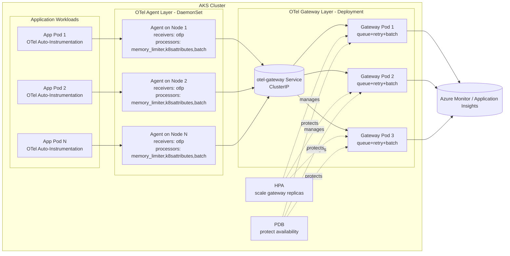
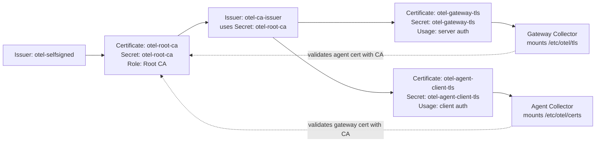

# OTel Production Depolyment

[中文入口](../README.md) | [English Home](../README.en.md) | [中文文档名](README.prod.md)

## Files

- networkpolicy.prod.yaml: production network policies (default deny + explicit allow rules).
- collector-tls.prod.yaml: cert-manager certificates and issuers for gateway/agent mTLS.
- gateway-values.prod.yaml: Helm values for gateway Collector (export and scaling behavior).
- agent-values.prod.yaml: Helm values for agent Collector (node-side receive/forward).
- ingress-nginx-values.prod.yaml: Helm values for ingress-nginx (AKS Load Balancer TCP health probe).
- otel-agent-service.prod.yaml: stable OTLP Service endpoint for application traffic into agent.
- otel-agent-rbac.prod.yaml: RBAC required by agent (k8sattributes permissions).
- inst-crd-dotnet.prod.yaml: production .NET auto-instrumentation CRD.
- inst-crd-python.prod.yaml: production Python auto-instrumentation CRD.
- otelapidemo-dotnet.yaml: production .NET sample app manifest (production annotation preconfigured).
- otelapidemo-python.yaml: production Python sample app manifest (production annotation preconfigured).
- otelapidemo-ingress.prod.yaml: shared production Ingress for sample apps (.NET and Python behind one Ingress resource).
- alerts-kql.prod.md: alerting and KQL guidance for production.
- version-baseline.current.md: production version baseline and change ledger.
- README.prod.md: Chinese production deployment guide.
- README.prod.en.md: this English production deployment guide.

## Prerequisites

1. Access to AKS cluster with `kubectl` and `helm` configured.
2. `cert-manager` installed and healthy in cluster.
3. Required namespaces exist (`observability`, `apps-prod`) and application namespace is labeled with `otel-client=true`.
4. App Insights connection string secret exists (`appinsights-conn`) in `observability`.
5. RBAC allows you to read and update releases in `observability` namespace.
6. NGINX Ingress Controller is installed in the cluster, and the `nginx` IngressClass exists. `otelapidemo-ingress.prod.yaml` depends on NGINX rewrite annotations to rewrite `/dotnet/*` and `/python/*` to the original backend paths. On AKS, set the ingress-nginx Service health probe for port 80 to TCP to avoid Azure Load Balancer HTTP `/` probes causing public access timeouts.

## Deploy Order

1. Label client namespaces and apply NetworkPolicy.
2. Create/update Application Insights connection string secret.
3. Apply cert-manager TLS manifests for gateway and agent certificates.
4. Deploy gateway collector (Deployment, multi-replica).
5. Deploy agent collector (DaemonSet).
6. Apply agent Service manifest (stable OTLP endpoint for applications).
7. Apply agent RBAC manifest (k8sattributes metadata extraction permissions).
8. Apply Instrumentation CRD.
9. Deploy otelapidemo sample applications (.NET and Python Services use `ClusterIP`).
10. Apply the shared Ingress to place .NET and Python behind one Ingress resource.
11. Verify baseline status.

## Commands

```bash
# 1) Create application namespace and allow OTel client traffic
kubectl create namespace apps-prod --dry-run=client -o yaml | kubectl apply -f -
kubectl label namespace apps-prod otel-client=true --overwrite
kubectl apply -f ./prod/networkpolicy.prod.yaml

# 2) Secret
kubectl create secret generic appinsights-conn \
  -n observability \
  --from-literal=connection_string="<APP_INSIGHTS_CONNECTION_STRING>" \
  --dry-run=client -o yaml | kubectl apply -f -

# 3) TLS certificates and secrets via cert-manager
kubectl apply -f ./prod/collector-tls.prod.yaml

# 4) Gateway (release name: otel-gateway)
helm upgrade --install otel-gateway open-telemetry/opentelemetry-collector \
  --version 0.162.0 \
  -n observability --create-namespace \
  -f ./prod/gateway-values.prod.yaml

# 5) Agent (release name: otel-agent)
helm upgrade --install otel-agent open-telemetry/opentelemetry-collector \
  --version 0.162.0 \
  -n observability --create-namespace \
  -f ./prod/agent-values.prod.yaml

# 6) Apply agent Service (stable OTLP endpoint)
kubectl apply -f ./prod/otel-agent-service.prod.yaml

# 7) Apply agent RBAC (k8sattributes permissions)
kubectl apply -f ./prod/otel-agent-rbac.prod.yaml

# 8) Instrumentation
kubectl apply -f ./prod/inst-crd-dotnet.prod.yaml
kubectl apply -f ./prod/inst-crd-python.prod.yaml

# 9) Deploy otelapidemo sample apps (prod manifests, Services use ClusterIP)
kubectl apply -n apps-prod -f ./prod/otelapidemo-dotnet.yaml
kubectl apply -n apps-prod -f ./prod/otelapidemo-python.yaml

# 9.5) Install or update NGINX Ingress Controller (AKS uses TCP health probe)
helm repo add ingress-nginx https://kubernetes.github.io/ingress-nginx
helm repo update ingress-nginx
helm upgrade --install ingress-nginx ingress-nginx/ingress-nginx \
  --namespace ingress-nginx --create-namespace \
  -f ./prod/ingress-nginx-values.prod.yaml

# 10) Apply shared Ingress (path-based routing: /dotnet and /python)
kubectl apply -n apps-prod -f ./prod/otelapidemo-ingress.prod.yaml

# 11) Verify
kubectl get pods -n observability
kubectl get deploy,ds -n observability
kubectl get svc -n observability otel-agent-opentelemetry-collector
kubectl get certificate -n observability
kubectl get pods -n apps-prod
kubectl get svc -n apps-prod otelapidemo otelapidemo-python
kubectl get ingress -n apps-prod otelapidemo
```

## Commands (PowerShell)

```powershell
# 1) Create application namespace and allow OTel client traffic
kubectl create namespace apps-prod --dry-run=client -o yaml | kubectl apply -f -
kubectl label namespace apps-prod otel-client=true --overwrite
kubectl apply -f ./prod/networkpolicy.prod.yaml

# 2) Secret
kubectl create secret generic appinsights-conn `
  -n observability `
  --from-literal=connection_string="<APP_INSIGHTS_CONNECTION_STRING>" `
  --dry-run=client -o yaml | kubectl apply -f -

# 3) TLS certificates and secrets via cert-manager
kubectl apply -f ./prod/collector-tls.prod.yaml

# 4) Gateway (release name: otel-gateway)
helm upgrade --install otel-gateway open-telemetry/opentelemetry-collector `
  --version 0.162.0 `
  -n observability --create-namespace `
  -f ./prod/gateway-values.prod.yaml

# 5) Agent (release name: otel-agent)
helm upgrade --install otel-agent open-telemetry/opentelemetry-collector `
  --version 0.162.0 `
  -n observability --create-namespace `
  -f ./prod/agent-values.prod.yaml

# 6) Apply agent Service (stable OTLP endpoint)
kubectl apply -f ./prod/otel-agent-service.prod.yaml

# 7) Apply agent RBAC (k8sattributes permissions)
kubectl apply -f ./prod/otel-agent-rbac.prod.yaml

# 8) Instrumentation
kubectl apply -f ./prod/inst-crd-dotnet.prod.yaml
kubectl apply -f ./prod/inst-crd-python.prod.yaml

# 9) Deploy otelapidemo sample apps (prod manifests, Services use ClusterIP)
kubectl apply -n apps-prod -f ./prod/otelapidemo-dotnet.yaml
kubectl apply -n apps-prod -f ./prod/otelapidemo-python.yaml

# 9.5) Install or update NGINX Ingress Controller (AKS uses TCP health probe)
helm repo add ingress-nginx https://kubernetes.github.io/ingress-nginx
helm repo update ingress-nginx
helm upgrade --install ingress-nginx ingress-nginx/ingress-nginx `
  --namespace ingress-nginx --create-namespace `
  -f ./prod/ingress-nginx-values.prod.yaml

# 10) Apply shared Ingress (path-based routing: /dotnet and /python)
kubectl apply -n apps-prod -f ./prod/otelapidemo-ingress.prod.yaml

# 11) Verify
kubectl get pods -n observability
kubectl get deploy,ds -n observability
kubectl get svc -n observability otel-agent-opentelemetry-collector
kubectl get instrumentation -n observability
kubectl get certificate -n observability
kubectl get pods -n apps-prod
kubectl get svc -n apps-prod otelapidemo otelapidemo-python
kubectl get ingress -n apps-prod otelapidemo

# 12) Collector pipeline counters (gateway)
$pod = kubectl get pods -n observability -l app.kubernetes.io/instance=otel-gateway -o jsonpath='{.items[0].metadata.name}'
kubectl get --raw "/api/v1/namespaces/observability/pods/${pod}:8888/proxy/metrics" |
  Select-String -Pattern "otelcol_receiver_accepted_spans|otelcol_exporter_sent_spans|otelcol_receiver_accepted_log_records|otelcol_exporter_sent_log_records|otelcol_receiver_accepted_metric_points|otelcol_exporter_sent_metric_points"

# 13) (Optional) Only needed when migrating old dev manifests
# New ./prod/otelapidemo-*.yaml already include production annotations
```

## Application Annotation Example

```yaml
metadata:
  annotations:
    instrumentation.opentelemetry.io/inject-dotnet: "observability/dotnet-auto-prod"
```

```yaml
metadata:
  annotations:
    instrumentation.opentelemetry.io/inject-python: "observability/python-auto-prod"
```

## Notes

- This baseline disables debug exporter and keeps azuremonitor only.
- Sampling is set to 10% (`0.1`) for production cost control.
- Applications send OTLP to `otel-agent-opentelemetry-collector.observability.svc.cluster.local:4317`; agent then forwards traffic to gateway.
- Production sample applications do not expose `LoadBalancer` Services directly. Both `.NET` and Python Services use `ClusterIP`, and external access is routed through the shared Ingress in `otelapidemo-ingress.prod.yaml`.
- The shared Ingress uses path-based routing: `/dotnet/*` routes to the `.NET` Service, and `/python/*` routes to the Python Service. NGINX rewrite strips the prefix, so backend applications keep their original `/weatherforecast` route and do not need code changes.
- The same agent/gateway architecture applies to Python workloads; only the Instrumentation CRD and application annotation differ.
- Image fields in `otelapidemo-*.yaml` use the placeholder `<ACR_LOGIN_SERVER>`; replace it with your real ACR login server before deployment.
- For Python, business logs still require application logging output; auto-instrumentation enables OTLP log export but does not create business log messages by itself.

## Troubleshooting Steps (No Data in AI After App Access)

1. Check component health: all agent/gateway Pods in `observability` must be `Running`.
2. Check OTLP entry service: `otel-agent-opentelemetry-collector` must exist and have endpoints.
3. Check auto-injection: the .NET app Pod annotation should be `observability/dotnet-auto-prod`, and the `opentelemetry-auto-instrumentation-dotnet` initContainer must exist. The Python app Pod annotation should be `observability/python-auto-prod`, with Python auto-instrumentation initContainer/env injection present.
4. Check Instrumentation CRDs: verify endpoint/sampler settings on both `dotnet-auto-prod` and `python-auto-prod`. Python should use OTLP HTTP/protobuf and port `4318`.
5. Send test traffic: hit business endpoint 50-200 times to avoid false negatives under sampling.
6. Check Collector self-observability: inspect exporter queue and error logs on agent/gateway.
7. Validate in App Insights: run broad KQL first, then narrow by `cloud_RoleName` or `service.name`.

### FAQ

#### Ingress has a public IP, but `/dotnet/weatherforecast` or `/python/weatherforecast` times out

Symptom: `kubectl get ingress -n apps-prod otelapidemo` shows a public address, and the Ingress rules plus Service endpoints look correct. Accessing the `ingress-nginx-controller` Service or the backend Services from inside the cluster returns `200`, but accessing port 80 on the public IP from the client machine times out.

Finding from this deployment: the Azure Load Balancer health probe created for the ingress-nginx `LoadBalancer` Service used HTTP `/` by default. When ingress-nginx has no matching rule for `/`, it returns `404`; Azure Load Balancer then treats the backend as unhealthy and public traffic times out. The backend apps, Ingress rewrite rules, and Service endpoints are not the problem in this case.

Quick checks:

```powershell
kubectl get svc -n ingress-nginx ingress-nginx-controller -o wide
kubectl get ingress -n apps-prod otelapidemo -o wide

# Verify from inside the cluster that the Ingress Service can route to the backend
kubectl run ingress-test --rm -i --restart=Never --image=curlimages/curl:8.11.1 -- curl -i --max-time 10 http://ingress-nginx-controller.ingress-nginx.svc.cluster.local/dotnet/weatherforecast

# Inspect Azure Load Balancer probe protocol and path
$nodeRg = az aks show -g <AKS_RESOURCE_GROUP> -n <AKS_CLUSTER_NAME> --query nodeResourceGroup -o tsv
az network lb probe list -g $nodeRg --lb-name kubernetes --query "[].{name:name, protocol:protocol, port:port, requestPath:requestPath}" -o table
```

Fix: install or upgrade ingress-nginx with `prod/ingress-nginx-values.prod.yaml`, which changes the port 80 health probe to TCP.

```bash
helm upgrade --install ingress-nginx ingress-nginx/ingress-nginx \
  --namespace ingress-nginx --create-namespace \
  -f ./prod/ingress-nginx-values.prod.yaml
```

Expected Helm values:

```yaml
controller:
  service:
    type: LoadBalancer
    annotations:
      service.beta.kubernetes.io/port_80_health-probe_protocol: Tcp
```

Verify after the fix:

```powershell
$ingressAddress = kubectl get ingress -n apps-prod otelapidemo -o jsonpath='{.status.loadBalancer.ingress[0].ip}'
Test-NetConnection $ingressAddress -Port 80
curl.exe -i --max-time 10 "http://$ingressAddress/dotnet/weatherforecast"
curl.exe -i --max-time 10 "http://$ingressAddress/python/weatherforecast"
```

#### Python auto-instrumentation produces no requests, dependencies, or logs in App Insights

Symptom: the application endpoint works, and the business log appears in Pod logs, but App Insights shows no Python `requests`, `dependencies`, or `traces` for the service.

Common cause: the Python auto-instrumentation image may not include the OTLP gRPC exporter package. Verify it inside the application Pod:

```powershell
$pod = kubectl get pods -n apps-prod -l app=otelapidemo-python -o jsonpath='{.items[0].metadata.name}'

kubectl exec -n apps-prod $pod -c otelapidemo-python -- python -m pip show opentelemetry-exporter-otlp-proto-grpc
kubectl exec -n apps-prod $pod -c otelapidemo-python -- python -m pip show opentelemetry-exporter-otlp-proto-http

kubectl exec -n apps-prod $pod -c otelapidemo-python -- python -c "import importlib.util; names=['opentelemetry.exporter.otlp.proto.grpc','opentelemetry.exporter.otlp.proto.http']; [print(name + ': ' + ('INSTALLED' if importlib.util.find_spec(name) else 'NOT INSTALLED')) for name in names]"
```

If the output is similar to the following, the current Python auto-instrumentation environment does not support OTLP gRPC but does support OTLP HTTP/protobuf:

```text
WARNING: Package(s) not found: opentelemetry-exporter-otlp-proto-grpc
Name: opentelemetry-exporter-otlp-proto-http
opentelemetry.exporter.otlp.proto.grpc: NOT INSTALLED
opentelemetry.exporter.otlp.proto.http: INSTALLED
```

Fix: configure Python Instrumentation to use OTLP HTTP/protobuf and port `4318`:

```yaml
spec:
  exporter:
    endpoint: http://otel-agent-opentelemetry-collector.observability.svc.cluster.local:4318
  python:
    env:
      - name: OTEL_EXPORTER_OTLP_PROTOCOL
        value: http/protobuf
```

After applying the Instrumentation, restart the Python Deployment and send 50-200 test requests. In App Insights, the `cloud_RoleName` is usually `apps-prod.otelapidemo-python`.

### Final App Insights Verification KQL (30m)

- After sending test traffic, restarting Pods, or changing Collector/Instrumentation config, wait 3-10 minutes before querying to avoid false negatives from ingestion delay.
- In Azure Monitor / App Insights, `cloud_RoleName` is usually composed from the Kubernetes namespace and service name. For example, `.NET` is `apps-prod.otelapidemo`, and Python is `apps-prod.otelapidemo-python`.
- If `cloud_RoleName` mapping differs in another environment, use `customDimensions["service.namespace"]` and `customDimensions["service.name"]` as fallback filters.

```kql
union requests, dependencies, traces
| where timestamp > ago(30m)
| where cloud_RoleName in~ ("apps-prod.otelapidemo", "apps-prod.otelapidemo-python")
  or (
    tostring(customDimensions["service.namespace"]) =~ "apps-prod"
    and tostring(customDimensions["service.name"]) in~ ("otelapidemo", "otelapidemo-python")
  )
| order by timestamp desc
```

### Quick Troubleshooting Script (PowerShell)

```powershell
$nsObs = "observability"
$nsApp = "apps-prod"
$dotnetApp = "otelapidemo"
$pythonApp = "otelapidemo-python"
$svc = "otel-agent-opentelemetry-collector"

Write-Host "== 1) Component health =="
kubectl get pods -n $nsObs -o wide
kubectl get pods -n $nsApp -l app=$dotnetApp -o wide
kubectl get pods -n $nsApp -l app=$pythonApp -o wide

Write-Host "== 2) OTLP entry service =="
kubectl get svc -n $nsObs $svc -o wide
kubectl get endpoints -n $nsObs $svc -o wide

Write-Host "== 3) Instrumentation and app annotation =="
kubectl get instrumentation -n $nsObs dotnet-auto-prod -o yaml
kubectl get instrumentation -n $nsObs python-auto-prod -o yaml
kubectl get deploy -n $nsApp $dotnetApp -o jsonpath='{.spec.template.metadata.annotations.instrumentation\.opentelemetry\.io/inject-dotnet}{"\n"}'
kubectl get deploy -n $nsApp $pythonApp -o jsonpath='{.spec.template.metadata.annotations.instrumentation\.opentelemetry\.io/inject-python}{"\n"}'
kubectl get pods -n $nsApp -l app=$dotnetApp -o jsonpath='{range .items[*]}{.metadata.name}{" initContainers="}{range .spec.initContainers[*]}{.name}{","}{end}{"\n"}{end}'
kubectl get pods -n $nsApp -l app=$pythonApp -o jsonpath='{range .items[*]}{.metadata.name}{" initContainers="}{range .spec.initContainers[*]}{.name}{","}{end}{"\n"}{end}'

Write-Host "== 4) Generate test traffic =="
$ingressAddress = kubectl get ingress -n $nsApp otelapidemo -o jsonpath='{.status.loadBalancer.ingress[0].ip}'
if ([string]::IsNullOrEmpty($ingressAddress)) {
  $ingressAddress = kubectl get ingress -n $nsApp otelapidemo -o jsonpath='{.status.loadBalancer.ingress[0].hostname}'
}
if ([string]::IsNullOrEmpty($ingressAddress)) {
  Write-Host "Ingress address not ready"
} else {
  1..100 | ForEach-Object {
    try { Invoke-WebRequest -Uri ("http://{0}/dotnet/weatherforecast" -f $ingressAddress) -UseBasicParsing -TimeoutSec 5 | Out-Null } catch {}
    try { Invoke-WebRequest -Uri ("http://{0}/python/weatherforecast" -f $ingressAddress) -UseBasicParsing -TimeoutSec 5 | Out-Null } catch {}
  }
  Write-Host "Traffic sent to http://$ingressAddress/dotnet/weatherforecast and /python/weatherforecast"
}

Write-Host "== 5) Key Collector logs (last 10m) =="
kubectl logs -n $nsObs -l app.kubernetes.io/instance=otel-agent --since=10m | Select-String -Pattern "forbidden|error|failed|otlp|gateway"
kubectl logs -n $nsObs -l app.kubernetes.io/instance=otel-gateway --since=10m | Select-String -Pattern "error|failed|azuremonitor|export|401|403|404|429|5[0-9][0-9]"
```

### Quick Troubleshooting Script (bash)

```bash
set -euo pipefail

NS_OBS="observability"
NS_APP="apps-prod"
DOTNET_APP="otelapidemo"
PYTHON_APP="otelapidemo-python"
SVC="otel-agent-opentelemetry-collector"

echo "== 1) Component health =="
kubectl get pods -n "$NS_OBS" -o wide
kubectl get pods -n "$NS_APP" -l app="$DOTNET_APP" -o wide
kubectl get pods -n "$NS_APP" -l app="$PYTHON_APP" -o wide

echo "== 2) OTLP entry service =="
kubectl get svc -n "$NS_OBS" "$SVC" -o wide
kubectl get endpoints -n "$NS_OBS" "$SVC" -o wide

echo "== 3) Instrumentation and app annotation =="
kubectl get instrumentation -n "$NS_OBS" dotnet-auto-prod -o yaml
kubectl get instrumentation -n "$NS_OBS" python-auto-prod -o yaml
kubectl get deploy -n "$NS_APP" "$DOTNET_APP" -o jsonpath='{.spec.template.metadata.annotations.instrumentation\.opentelemetry\.io/inject-dotnet}{"\n"}'
kubectl get deploy -n "$NS_APP" "$PYTHON_APP" -o jsonpath='{.spec.template.metadata.annotations.instrumentation\.opentelemetry\.io/inject-python}{"\n"}'
kubectl get pods -n "$NS_APP" -l app="$DOTNET_APP" -o jsonpath='{range .items[*]}{.metadata.name}{" initContainers="}{range .spec.initContainers[*]}{.name}{","}{end}{"\n"}{end}'
kubectl get pods -n "$NS_APP" -l app="$PYTHON_APP" -o jsonpath='{range .items[*]}{.metadata.name}{" initContainers="}{range .spec.initContainers[*]}{.name}{","}{end}{"\n"}{end}'

echo "== 4) Generate test traffic =="
INGRESS_ADDRESS=$(kubectl get ingress -n "$NS_APP" otelapidemo -o jsonpath='{.status.loadBalancer.ingress[0].ip}')
if [ -z "${INGRESS_ADDRESS}" ]; then
  INGRESS_ADDRESS=$(kubectl get ingress -n "$NS_APP" otelapidemo -o jsonpath='{.status.loadBalancer.ingress[0].hostname}')
fi
if [ -n "${INGRESS_ADDRESS}" ]; then
  for i in $(seq 1 100); do
    curl -sS "http://${INGRESS_ADDRESS}/dotnet/weatherforecast" >/dev/null || true
    curl -sS "http://${INGRESS_ADDRESS}/python/weatherforecast" >/dev/null || true
  done
  echo "Traffic sent to http://${INGRESS_ADDRESS}/dotnet/weatherforecast and /python/weatherforecast"
else
  echo "Ingress address not ready"
fi

echo "== 5) Key Collector logs (last 10m) =="
kubectl logs -n "$NS_OBS" -l app.kubernetes.io/instance=otel-agent --since=10m | egrep -i "forbidden|error|failed|otlp|gateway" || true
kubectl logs -n "$NS_OBS" -l app.kubernetes.io/instance=otel-gateway --since=10m | egrep -i "error|failed|azuremonitor|export|401|403|404|429|5[0-9][0-9]" || true
```

## Collector Architecture (Production)



## Certificate Relationships



## Collector Alert Threshold Guidance

1. `otelcol_exporter_send_failed_* > 0` for 5 minutes: Sev2.
2. `otelcol_receiver_refused_* > 0` for 5 minutes: Sev2.
3. Accepted minus sent counters increase continuously for 10 minutes: Sev2.
4. Exporter queue usage > 70% for 10 minutes: Sev3.
5. Exporter queue usage > 90% for 5 minutes: Sev2.
6. Collector pod restarts >= 2 within 10 minutes: Sev2.
7. HPA at max replicas for 15+ minutes: Sev3 (capacity warning).
8. Export latency P95 > 5 seconds for 10 minutes: Sev3.

## Upgrade Pre-Checks

Before any OTel upgrade, capture current state so rollback is deterministic.

0. Update `./prod/version-baseline.current.md` with current test software versions (chart/image/operator/cert-manager/k8s/helm) before starting upgrade.

1. Export current release values (this is what item #2 means): save the effective values currently running in cluster as your rollback baseline.

```bash
mkdir -p ./prod/upgrade-baseline
helm get values otel-gateway -n observability -o yaml > ./prod/upgrade-baseline/otel-gateway.values.current.yaml
helm get values otel-agent -n observability -o yaml > ./prod/upgrade-baseline/otel-agent.values.current.yaml
```

```powershell
New-Item -ItemType Directory -Force -Path ./prod/upgrade-baseline | Out-Null
helm get values otel-gateway -n observability -o yaml | Out-File -Encoding utf8 ./prod/upgrade-baseline/otel-gateway.values.current.yaml
helm get values otel-agent -n observability -o yaml | Out-File -Encoding utf8 ./prod/upgrade-baseline/otel-agent.values.current.yaml
```

2. Record current chart version / image tag / operator version (item #3).

```bash
# Chart versions
helm list -n observability | grep -E 'otel-gateway|otel-agent'

# Collector image tags currently running
kubectl get deploy -n observability otel-gateway-opentelemetry-collector -o jsonpath='{.spec.template.spec.containers[0].image}{"\n"}'
kubectl get ds -n observability otel-agent-opentelemetry-collector -o jsonpath='{.spec.template.spec.containers[0].image}{"\n"}'

# Operator version (deployment image)
kubectl get deploy -n opentelemetry-operator-system opentelemetry-operator -o jsonpath='{.spec.template.spec.containers[0].image}{"\n"}'
```

```powershell
# Chart versions
helm list -n observability | Select-String -Pattern 'otel-gateway|otel-agent'

# Collector image tags currently running
kubectl get deploy -n observability otel-gateway-opentelemetry-collector -o jsonpath='{.spec.template.spec.containers[0].image}{"`n"}'
kubectl get ds -n observability otel-agent-opentelemetry-collector -o jsonpath='{.spec.template.spec.containers[0].image}{"`n"}'

# Operator version (deployment image)
kubectl get deploy -n opentelemetry-operator-system opentelemetry-operator -o jsonpath='{.spec.template.spec.containers[0].image}{"`n"}'
```

3. Run a baseline validation before upgrade: traces, metrics, logs pipeline counters, App Insights ingestion, collector self-metrics, and HPA/PDB status.

