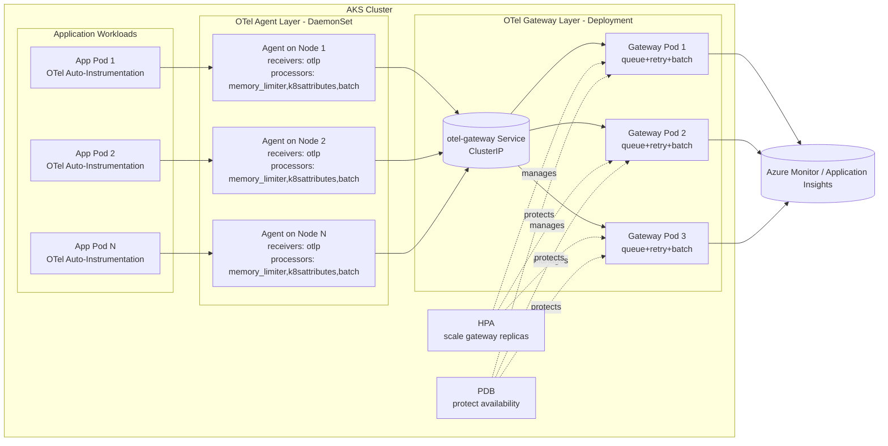
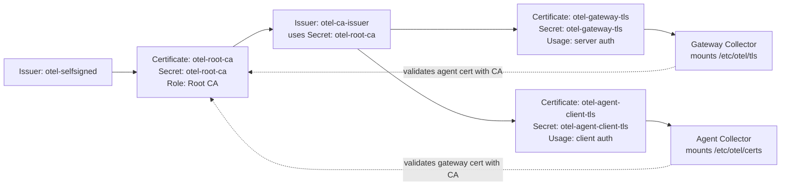

# OTel Production Depolyment

[中文入口](../README.md) | [English Home](../README.en.md) | [中文文档名](README.prod.md)

## Files

- networkpolicy.prod.yaml
- collector-tls.prod.yaml
- gateway-values.prod.yaml
- agent-values.prod.yaml
- otel-agent-service.prod.yaml
- otel-agent-rbac.prod.yaml
- inst-crd-dotnet.prod.yaml
- inst-crd-python.prod.yaml
- alerts-kql.prod.md
- version-baseline.current.md

## Prerequisites

1. Access to AKS cluster with `kubectl` and `helm` configured.
2. `cert-manager` installed and healthy in cluster.
3. Required namespaces exist (`observability`, `apps-prod`) and application namespace is labeled with `otel-client=true`.
4. App Insights connection string secret exists (`appinsights-conn`) in `observability`.
5. RBAC allows you to read and update releases in `observability` namespace.

## Deploy Order

1. Label client namespaces and apply NetworkPolicy.
2. Create/update Application Insights connection string secret.
3. Apply cert-manager TLS manifests for gateway and agent certificates.
4. Deploy gateway collector (Deployment, multi-replica).
5. Deploy agent collector (DaemonSet).
6. Apply agent Service manifest (stable OTLP endpoint for applications).
7. Apply agent RBAC manifest (k8sattributes metadata extraction permissions).
8. Apply Instrumentation CRD.
9. Deploy the otelapidemo sample application.
10. Update application annotation to use dotnet-auto-prod.

## Commands

```bash
# 1) Create application namespace and allow OTel client traffic
kubectl create namespace apps-prod --dry-run=client -o yaml | kubectl apply -f -
kubectl label namespace apps-prod otel-client=true --overwrite
kubectl apply -f ./prod/networkpolicy.prod.yaml

# 2) Secret
kubectl create secret generic appinsights-conn \
  -n observability \
  --from-literal=connection_string="<APP_INSIGHTS_CONNECTION_STRING>" \
  --dry-run=client -o yaml | kubectl apply -f -

# 3) TLS certificates and secrets via cert-manager
kubectl apply -f ./prod/collector-tls.prod.yaml

# 4) Gateway (release name: otel-gateway)
helm upgrade --install otel-gateway open-telemetry/opentelemetry-collector \
  --version 0.162.0 \
  -n observability --create-namespace \
  -f ./prod/gateway-values.prod.yaml

# 5) Agent (release name: otel-agent)
helm upgrade --install otel-agent open-telemetry/opentelemetry-collector \
  --version 0.162.0 \
  -n observability --create-namespace \
  -f ./prod/agent-values.prod.yaml

# 6) Apply agent Service (stable OTLP endpoint)
kubectl apply -f ./prod/otel-agent-service.prod.yaml

# 7) Apply agent RBAC (k8sattributes permissions)
kubectl apply -f ./prod/otel-agent-rbac.prod.yaml

# 8) Instrumentation
kubectl apply -f ./prod/inst-crd-dotnet.prod.yaml
kubectl apply -f ./prod/inst-crd-python.prod.yaml

# 9) Deploy otelapidemo sample app
kubectl apply -n apps-prod -f ./dev/otelapidemo-dotnet.yaml

# 10) Verify
kubectl get pods -n observability
kubectl get deploy,ds -n observability
kubectl get svc -n observability otel-agent-opentelemetry-collector
kubectl get certificate -n observability
kubectl get pods -n apps-prod
```

## Commands (PowerShell)

```powershell
# 1) Create application namespace and allow OTel client traffic
kubectl create namespace apps-prod --dry-run=client -o yaml | kubectl apply -f -
kubectl label namespace apps-prod otel-client=true --overwrite
kubectl apply -f ./prod/networkpolicy.prod.yaml

# 2) Secret
kubectl create secret generic appinsights-conn `
  -n observability `
  --from-literal=connection_string="<APP_INSIGHTS_CONNECTION_STRING>" `
  --dry-run=client -o yaml | kubectl apply -f -

# 3) TLS certificates and secrets via cert-manager
kubectl apply -f ./prod/collector-tls.prod.yaml

# 4) Gateway (release name: otel-gateway)
helm upgrade --install otel-gateway open-telemetry/opentelemetry-collector `
  --version 0.162.0 `
  -n observability --create-namespace `
  -f ./prod/gateway-values.prod.yaml

# 5) Agent (release name: otel-agent)
helm upgrade --install otel-agent open-telemetry/opentelemetry-collector `
  --version 0.162.0 `
  -n observability --create-namespace `
  -f ./prod/agent-values.prod.yaml

# 6) Apply agent Service (stable OTLP endpoint)
kubectl apply -f ./prod/otel-agent-service.prod.yaml

# 7) Apply agent RBAC (k8sattributes permissions)
kubectl apply -f ./prod/otel-agent-rbac.prod.yaml

# 8) Instrumentation
kubectl apply -f ./prod/inst-crd-dotnet.prod.yaml
kubectl apply -f ./prod/inst-crd-python.prod.yaml

# 9) Deploy otelapidemo sample app
kubectl apply -n apps-prod -f ./dev/otelapidemo-dotnet.yaml

# 10) Verify
kubectl get pods -n observability
kubectl get deploy,ds -n observability
kubectl get svc -n observability otel-agent-opentelemetry-collector
kubectl get instrumentation -n observability
kubectl get certificate -n observability
kubectl get pods -n apps-prod

# 11) Collector pipeline counters (gateway)
$pod = kubectl get pods -n observability -l app.kubernetes.io/instance=otel-gateway -o jsonpath='{.items[0].metadata.name}'
kubectl get --raw "/api/v1/namespaces/observability/pods/${pod}:8888/proxy/metrics" |
  Select-String -Pattern "otelcol_receiver_accepted_spans|otelcol_exporter_sent_spans|otelcol_receiver_accepted_log_records|otelcol_exporter_sent_log_records|otelcol_receiver_accepted_metric_points|otelcol_exporter_sent_metric_points"

# 12) Switch app pod-template annotation to production instrumentation
kubectl patch deployment otelapidemo `
  -n apps-prod `
  --type merge `
  -p '{"spec":{"template":{"metadata":{"annotations":{"instrumentation.opentelemetry.io/inject-dotnet":"observability/dotnet-auto-prod"}}}}}'

kubectl rollout restart deployment/otelapidemo -n apps-prod
kubectl rollout status deployment/otelapidemo -n apps-prod
```

## Application Annotation Example

```yaml
metadata:
  annotations:
    instrumentation.opentelemetry.io/inject-dotnet: "observability/dotnet-auto-prod"
```

```yaml
metadata:
  annotations:
    instrumentation.opentelemetry.io/inject-python: "observability/python-auto-prod"
```

## Notes

- This baseline disables debug exporter and keeps azuremonitor only.
- Sampling is set to 10% (`0.1`) for production cost control.
- Agent forwards OTLP to gateway using service DNS `otel-gateway-opentelemetry-collector.observability.svc.cluster.local:4317`.
- The same agent/gateway architecture applies to Python workloads; only the Instrumentation CRD and application annotation differ.
- For Python, business logs still require application logging output; auto-instrumentation enables OTLP log export but does not create business log messages by itself.

## Troubleshooting Steps (No Data in AI After App Access)

1. Check component health: all agent/gateway Pods in `observability` must be `Running`.
2. Check OTLP entry service: `otel-agent-opentelemetry-collector` must exist and have endpoints.
3. Check auto-injection: app Pod annotation should be `observability/dotnet-auto-prod`, and `opentelemetry-auto-instrumentation-dotnet` initContainer must exist.
4. Check Instrumentation CRD: verify endpoint/sampler settings on `dotnet-auto-prod`.
5. Send test traffic: hit business endpoint 50-200 times to avoid false negatives under sampling.
6. Check Collector self-observability: inspect exporter queue and error logs on agent/gateway.
7. Validate in App Insights: run broad KQL first, then narrow by `cloud_RoleName` or `service.name`.

### Quick Troubleshooting Script (PowerShell)

```powershell
$nsObs = "observability"
$nsApp = "apps-prod"
$app = "otelapidemo"
$svc = "otel-agent-opentelemetry-collector"

Write-Host "== 1) Component health =="
kubectl get pods -n $nsObs -o wide
kubectl get pods -n $nsApp -l app=$app -o wide

Write-Host "== 2) OTLP entry service =="
kubectl get svc -n $nsObs $svc -o wide
kubectl get endpoints -n $nsObs $svc -o wide

Write-Host "== 3) Instrumentation and app annotation =="
kubectl get instrumentation -n $nsObs dotnet-auto-prod -o yaml
kubectl get deploy -n $nsApp $app -o jsonpath='{.spec.template.metadata.annotations.instrumentation\.opentelemetry\.io/inject-dotnet}{"`n"}'

Write-Host "== 4) Generate test traffic =="
$lb = kubectl get svc -n $nsApp $app -o jsonpath='{.status.loadBalancer.ingress[0].ip}'
if ([string]::IsNullOrEmpty($lb)) {
  Write-Host "LoadBalancer IP not ready"
} else {
  1..100 | ForEach-Object {
    try { Invoke-WebRequest -Uri ("http://{0}/weatherforecast" -f $lb) -UseBasicParsing -TimeoutSec 5 | Out-Null } catch {}
  }
  Write-Host "Traffic sent to http://$lb/weatherforecast"
}

Write-Host "== 5) Key Collector logs (last 10m) =="
kubectl logs -n $nsObs -l app.kubernetes.io/instance=otel-agent --since=10m | Select-String -Pattern "forbidden|error|failed|otlp|gateway"
kubectl logs -n $nsObs -l app.kubernetes.io/instance=otel-gateway --since=10m | Select-String -Pattern "error|failed|azuremonitor|export|401|403|404|429|5[0-9][0-9]"
```

### Quick Troubleshooting Script (bash)

```bash
set -euo pipefail

NS_OBS="observability"
NS_APP="apps-prod"
APP="otelapidemo"
SVC="otel-agent-opentelemetry-collector"

echo "== 1) Component health =="
kubectl get pods -n "$NS_OBS" -o wide
kubectl get pods -n "$NS_APP" -l app="$APP" -o wide

echo "== 2) OTLP entry service =="
kubectl get svc -n "$NS_OBS" "$SVC" -o wide
kubectl get endpoints -n "$NS_OBS" "$SVC" -o wide

echo "== 3) Instrumentation and app annotation =="
kubectl get instrumentation -n "$NS_OBS" dotnet-auto-prod -o yaml
kubectl get deploy -n "$NS_APP" "$APP" -o jsonpath='{.spec.template.metadata.annotations.instrumentation\.opentelemetry\.io/inject-dotnet}{"\n"}'

echo "== 4) Generate test traffic =="
LB_IP=$(kubectl get svc -n "$NS_APP" "$APP" -o jsonpath='{.status.loadBalancer.ingress[0].ip}')
if [ -n "${LB_IP}" ]; then
  for i in $(seq 1 100); do
    curl -sS "http://${LB_IP}/weatherforecast" >/dev/null || true
  done
  echo "Traffic sent to http://${LB_IP}/weatherforecast"
else
  echo "LoadBalancer IP not ready"
fi

echo "== 5) Key Collector logs (last 10m) =="
kubectl logs -n "$NS_OBS" -l app.kubernetes.io/instance=otel-agent --since=10m | egrep -i "forbidden|error|failed|otlp|gateway" || true
kubectl logs -n "$NS_OBS" -l app.kubernetes.io/instance=otel-gateway --since=10m | egrep -i "error|failed|azuremonitor|export|401|403|404|429|5[0-9][0-9]" || true
```

## Collector Architecture (Production)



## Certificate Relationships



## Collector Alert Threshold Guidance

1. `otelcol_exporter_send_failed_* > 0` for 5 minutes: Sev2.
2. `otelcol_receiver_refused_* > 0` for 5 minutes: Sev2.
3. Accepted minus sent counters increase continuously for 10 minutes: Sev2.
4. Exporter queue usage > 70% for 10 minutes: Sev3.
5. Exporter queue usage > 90% for 5 minutes: Sev2.
6. Collector pod restarts >= 2 within 10 minutes: Sev2.
7. HPA at max replicas for 15+ minutes: Sev3 (capacity warning).
8. Export latency P95 > 5 seconds for 10 minutes: Sev3.

## Upgrade Pre-Checks

Before any OTel upgrade, capture current state so rollback is deterministic.

0. Update `./prod/version-baseline.current.md` with current test software versions (chart/image/operator/cert-manager/k8s/helm) before starting upgrade.

1. Export current release values (this is what item #2 means): save the effective values currently running in cluster as your rollback baseline.

```bash
mkdir -p ./prod/upgrade-baseline
helm get values otel-gateway -n observability -o yaml > ./prod/upgrade-baseline/otel-gateway.values.current.yaml
helm get values otel-agent -n observability -o yaml > ./prod/upgrade-baseline/otel-agent.values.current.yaml
```

```powershell
New-Item -ItemType Directory -Force -Path ./prod/upgrade-baseline | Out-Null
helm get values otel-gateway -n observability -o yaml | Out-File -Encoding utf8 ./prod/upgrade-baseline/otel-gateway.values.current.yaml
helm get values otel-agent -n observability -o yaml | Out-File -Encoding utf8 ./prod/upgrade-baseline/otel-agent.values.current.yaml
```

2. Record current chart version / image tag / operator version (item #3).

```bash
# Chart versions
helm list -n observability | grep -E 'otel-gateway|otel-agent'

# Collector image tags currently running
kubectl get deploy -n observability otel-gateway-opentelemetry-collector -o jsonpath='{.spec.template.spec.containers[0].image}{"\n"}'
kubectl get ds -n observability otel-agent-opentelemetry-collector -o jsonpath='{.spec.template.spec.containers[0].image}{"\n"}'

# Operator version (deployment image)
kubectl get deploy -n opentelemetry-operator-system opentelemetry-operator -o jsonpath='{.spec.template.spec.containers[0].image}{"\n"}'
```

```powershell
# Chart versions
helm list -n observability | Select-String -Pattern 'otel-gateway|otel-agent'

# Collector image tags currently running
kubectl get deploy -n observability otel-gateway-opentelemetry-collector -o jsonpath='{.spec.template.spec.containers[0].image}{"`n"}'
kubectl get ds -n observability otel-agent-opentelemetry-collector -o jsonpath='{.spec.template.spec.containers[0].image}{"`n"}'

# Operator version (deployment image)
kubectl get deploy -n opentelemetry-operator-system opentelemetry-operator -o jsonpath='{.spec.template.spec.containers[0].image}{"`n"}'
```

3. Run a baseline validation before upgrade: traces, metrics, logs pipeline counters, App Insights ingestion, collector self-metrics, and HPA/PDB status.

