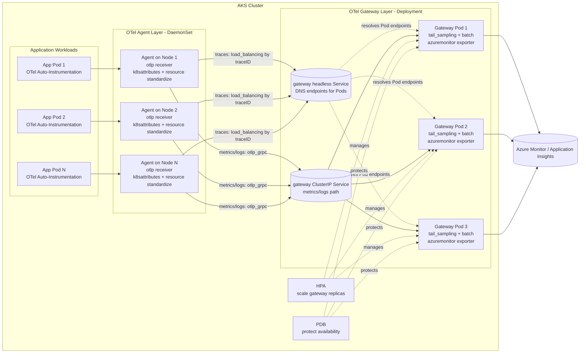
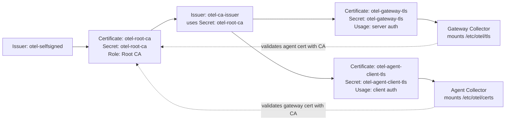

# OTel Production Depolyment

[中文入口](../README.md) | [English Home](../README.en.md) | [中文文档名](README.prod.md)

## Files

- networkpolicy.prod.yaml: production network policies (default deny + explicit allow rules).
- collector-tls.prod.yaml: cert-manager certificates and issuers for gateway/agent mTLS.
- gateway-values.prod.yaml: Helm values for gateway Collector (export and scaling behavior).
- agent-values.prod.yaml: Helm values for agent Collector (node-side receive/forward).
- ingress-nginx-values.prod.yaml: Helm values for ingress-nginx (AKS Load Balancer TCP health probe).
- otel-gateway-headless.prod.yaml: gateway headless Service for agent trace ID routing to gateway Pods.
- otel-agent-service.prod.yaml: stable OTLP Service endpoint for application traffic into agent.
- otel-agent-rbac.prod.yaml: RBAC required by agent (k8sattributes permissions).
- inst-crd-dotnet.prod.yaml: production .NET auto-instrumentation CRD.
- inst-crd-python.prod.yaml: production Python auto-instrumentation CRD.
- apps/otelapidemo-dotnet.yaml: production .NET sample app manifest (production annotation preconfigured).
- apps/otelapidemo-python.yaml: production Python sample app manifest (production annotation preconfigured).
- apps/kustomization.yaml: production sample app Kustomize entrypoint (replaces ACR image names).
- apps/otelapidemo-ingress.prod.yaml: shared production Ingress for sample apps (.NET and Python behind one Ingress resource).
- alerts-kql.prod.md: alerting and KQL guidance for production.
- appinsights-dashboard.prod.en.md: Application Insights dashboard guide (application runtime + common OTel metrics).
- version-baseline.current.md: production version baseline and change ledger.
- README.prod.md: Chinese production deployment guide.
- README.prod.en.md: this English production deployment guide.

## Prerequisites

1. Access to AKS cluster with `kubectl` and `helm` configured.
2. `cert-manager` installed and healthy in cluster.
3. Required namespaces exist (`observability`, `apps-prod`) and application namespace is labeled with `otel-client=true`.
4. App Insights connection string secret exists (`appinsights-conn`) in `observability`.
5. RBAC allows you to read and update releases in `observability` namespace.
6. NGINX Ingress Controller is installed in the cluster, and the `nginx` IngressClass exists. `apps/otelapidemo-ingress.prod.yaml` depends on NGINX rewrite annotations to rewrite `/dotnet/*` and `/python/*` to the original backend paths. On AKS, set the ingress-nginx Service health probe for port 80 to TCP to avoid Azure Load Balancer HTTP `/` probes causing public access timeouts.
7. Before deployment, replace `<AKS_CLUSTER_NAME>` in `gateway-values.prod.yaml` and `agent-values.prod.yaml` with the actual AKS cluster name. This value standardizes the `k8s.cluster.name` resource attribute.

## Deploy Order

1. Label client namespaces and apply NetworkPolicy.
2. Install or upgrade OpenTelemetry Operator and verify it is healthy.
3. Create/update Application Insights connection string secret.
4. Apply cert-manager TLS manifests for gateway and agent certificates.
5. Deploy gateway collector (Deployment, multi-replica).
6. Deploy agent collector (DaemonSet).
7. Apply agent Service manifest (stable OTLP endpoint for applications).
8. Apply agent RBAC manifest (k8sattributes metadata extraction permissions).
9. Apply Instrumentation CRD.
10. Deploy otelapidemo sample applications (.NET and Python Services use `ClusterIP`).
11. Apply the shared Ingress to place .NET and Python behind one Ingress resource.
12. Verify baseline status.

## Commands (bash)

```bash
# 1) Create application namespace and allow OTel client traffic
kubectl create namespace apps-prod --dry-run=client -o yaml | kubectl apply -f -
kubectl label namespace apps-prod otel-client=true --overwrite
kubectl apply -f ./prod/networkpolicy.prod.yaml

# 2) Install or upgrade OpenTelemetry Operator (release name: opentelemetry-operator)
helm upgrade --install opentelemetry-operator open-telemetry/opentelemetry-operator \
  --version 0.118.0 \
  -n opentelemetry-operator-system --create-namespace
kubectl get pods -n opentelemetry-operator-system

# 3) Secret
kubectl create secret generic appinsights-conn \
  -n observability \
  --from-literal=connection_string="<APP_INSIGHTS_CONNECTION_STRING>" \
  --dry-run=client -o yaml | kubectl apply -f -

# 4) TLS certificates and secrets via cert-manager
kubectl apply -f ./prod/collector-tls.prod.yaml

# 5) Gateway (release name: otel-gateway)
helm upgrade --install otel-gateway open-telemetry/opentelemetry-collector \
  --version 0.162.0 \
  -n observability --create-namespace \
  -f ./prod/gateway-values.prod.yaml

# 5.5) Apply Gateway headless Service (agent routes to gateway Pods by trace ID)
kubectl apply -f ./prod/otel-gateway-headless.prod.yaml

# 6) Agent (release name: otel-agent)
helm upgrade --install otel-agent open-telemetry/opentelemetry-collector \
  --version 0.162.0 \
  -n observability --create-namespace \
  -f ./prod/agent-values.prod.yaml

# 7) Apply agent Service (stable OTLP endpoint)
kubectl apply -f ./prod/otel-agent-service.prod.yaml

# 8) Apply agent RBAC (k8sattributes permissions)
kubectl apply -f ./prod/otel-agent-rbac.prod.yaml

# 9) Instrumentation
kubectl apply -f ./prod/inst-crd-dotnet.prod.yaml
kubectl apply -f ./prod/inst-crd-python.prod.yaml

# 10) Deploy otelapidemo sample apps (local ACR replacement; real ACR is not committed)
# Set ACR_LOGIN_SERVER first, or create prod/apps/.env.local (example: ACR_LOGIN_SERVER=myacr.azurecr.io)
export ACR_LOGIN_SERVER="myacr.azurecr.io"
./prod/apps/deploy-apps.sh

# 10.5) Install or update NGINX Ingress Controller (AKS uses TCP health probe)
helm repo add ingress-nginx https://kubernetes.github.io/ingress-nginx
helm repo update ingress-nginx
helm upgrade --install ingress-nginx ingress-nginx/ingress-nginx \
  --namespace ingress-nginx --create-namespace \
  -f ./prod/ingress-nginx-values.prod.yaml

# 11) Apply shared Ingress (path-based routing: /dotnet and /python)
kubectl apply -n apps-prod -f ./prod/apps/otelapidemo-ingress.prod.yaml

# 12) Verify
kubectl get pods -n observability
kubectl get deploy,ds -n observability
kubectl get svc -n observability otel-agent-opentelemetry-collector
kubectl get certificate -n observability
kubectl get pods -n apps-prod
kubectl get svc -n apps-prod otelapidemo otelapidemo-python
kubectl get ingress -n apps-prod otelapidemo
```

## Commands (PowerShell)

```powershell
# 1) Create application namespace and allow OTel client traffic
kubectl create namespace apps-prod --dry-run=client -o yaml | kubectl apply -f -
kubectl label namespace apps-prod otel-client=true --overwrite
kubectl apply -f ./prod/networkpolicy.prod.yaml

# 2) Install or upgrade OpenTelemetry Operator (release name: opentelemetry-operator)
helm upgrade --install opentelemetry-operator open-telemetry/opentelemetry-operator `
  --version 0.118.0 `
  -n opentelemetry-operator-system --create-namespace
kubectl get pods -n opentelemetry-operator-system

# 3) Secret
kubectl create secret generic appinsights-conn `
  -n observability `
  --from-literal=connection_string="<APP_INSIGHTS_CONNECTION_STRING>" `
  --dry-run=client -o yaml | kubectl apply -f -

# 4) TLS certificates and secrets via cert-manager
kubectl apply -f ./prod/collector-tls.prod.yaml

# 5) Gateway (release name: otel-gateway)
helm upgrade --install otel-gateway open-telemetry/opentelemetry-collector `
  --version 0.162.0 `
  -n observability --create-namespace `
  -f ./prod/gateway-values.prod.yaml

# 5.5) Apply Gateway headless Service (agent routes to gateway Pods by trace ID)
kubectl apply -f ./prod/otel-gateway-headless.prod.yaml

# 6) Agent (release name: otel-agent)
helm upgrade --install otel-agent open-telemetry/opentelemetry-collector `
  --version 0.162.0 `
  -n observability --create-namespace `
  -f ./prod/agent-values.prod.yaml

# 7) Apply agent Service (stable OTLP endpoint)
kubectl apply -f ./prod/otel-agent-service.prod.yaml

# 8) Apply agent RBAC (k8sattributes permissions)
kubectl apply -f ./prod/otel-agent-rbac.prod.yaml

# 9) Instrumentation
kubectl apply -f ./prod/inst-crd-dotnet.prod.yaml
kubectl apply -f ./prod/inst-crd-python.prod.yaml

# 10) Deploy otelapidemo sample apps (local ACR replacement; real ACR is not committed)
# Set ACR_LOGIN_SERVER first, or create prod/apps/.env.local (example: ACR_LOGIN_SERVER=<ACR_LOGIN_SERVER>)
$env:ACR_LOGIN_SERVER = "<ACR_LOGIN_SERVER>"
./prod/apps/deploy-apps.ps1
# bash/zsh: ./prod/apps/deploy-apps.sh

# 10.5) Install or update NGINX Ingress Controller (AKS uses TCP health probe)
helm repo add ingress-nginx https://kubernetes.github.io/ingress-nginx
helm repo update ingress-nginx
helm upgrade --install ingress-nginx ingress-nginx/ingress-nginx `
  --namespace ingress-nginx --create-namespace `
  -f ./prod/ingress-nginx-values.prod.yaml

# 11) Apply shared Ingress (path-based routing: /dotnet and /python)
kubectl apply -n apps-prod -f ./prod/apps/otelapidemo-ingress.prod.yaml

# 12) Verify
kubectl get pods -n observability
kubectl get deploy,ds -n observability
kubectl get svc -n observability otel-agent-opentelemetry-collector
kubectl get instrumentation -n observability
kubectl get certificate -n observability
kubectl get pods -n apps-prod
kubectl get svc -n apps-prod otelapidemo otelapidemo-python
kubectl get ingress -n apps-prod otelapidemo

# 13) Collector pipeline counters (gateway)
$pod = kubectl get pods -n observability -l app.kubernetes.io/instance=otel-gateway -o jsonpath='{.items[0].metadata.name}'
kubectl get --raw "/api/v1/namespaces/observability/pods/${pod}:8888/proxy/metrics" |
  Select-String -Pattern "otelcol_receiver_accepted_spans|otelcol_exporter_sent_spans|otelcol_receiver_accepted_log_records|otelcol_exporter_sent_log_records|otelcol_receiver_accepted_metric_points|otelcol_exporter_sent_metric_points"

# 14) (Optional) Only needed when migrating old dev manifests
# New ./prod/apps/otelapidemo-*.yaml already include production annotations
```

## Application Annotation Example

```yaml
metadata:
  annotations:
    instrumentation.opentelemetry.io/inject-dotnet: "observability/dotnet-auto-prod"
```

```yaml
metadata:
  annotations:
    instrumentation.opentelemetry.io/inject-python: "observability/python-auto-prod"
```

## Notes

- This baseline disables debug exporter and keeps azuremonitor only.
- Production traces use gateway tail sampling: applications use `always_on` and send all spans, while gateway keeps error traces, traces slower than 1000ms, and applies 10% probabilistic sampling to the remaining normal traces.
- Tail sampling currently uses option B: gateway keeps multiple replicas for high availability, while the agent traces pipeline uses the `load_balancing/gateway` exporter to route by trace ID to gateway Pods exposed through a headless Service. This keeps all spans for one trace on the same tail sampler.
- Collectors standardize resource attributes by adding `deployment.environment.name=prod`, `cloud.provider=azure`, `cloud.platform=azure_aks`, `k8s.cluster.name=<AKS_CLUSTER_NAME>`, and by filling `service.namespace` from `k8s.namespace.name` when the application has not set it explicitly.
- The sample applications explicitly set `service.namespace=apps-prod` and `service.version=1.0.2`; production workloads should replace `service.version` with the real release or image version.
- Applications send OTLP to `otel-agent-opentelemetry-collector.observability.svc.cluster.local:4317/4318`. The agent traces pipeline uses `load_balancing/gateway` plus the gateway headless Service to route by trace ID; metrics/logs pipelines use `otlp_grpc/gateway` through the regular gateway ClusterIP Service.
- Production sample applications do not expose `LoadBalancer` Services directly. Both `.NET` and Python Services use `ClusterIP`, and external access is routed through the shared Ingress in `apps/otelapidemo-ingress.prod.yaml`.
- The shared Ingress uses path-based routing: `/dotnet/*` routes to the `.NET` Service, and `/python/*` routes to the Python Service. NGINX rewrite strips the prefix, so backend applications keep their original `/weatherforecast` route and do not need code changes.
- The same agent/gateway architecture applies to Python workloads; only the Instrumentation CRD and application annotation differ.
- Image fields in `apps/otelapidemo-*.yaml` keep the `<ACR_LOGIN_SERVER>` placeholder; deployment scripts `prod/apps/deploy-apps.ps1` and `prod/apps/deploy-apps.sh` read the real ACR from the `ACR_LOGIN_SERVER` environment variable or ignored local file `prod/apps/.env.local`, then replace the placeholder only before applying to the cluster.
- Real ACR, subscription, and publish profile values are not committed. For local publish settings, copy `otelapidemo/otelapidemo/Properties/PublishProfiles/acr.pubxml.example` to a local `.pubxml` file and fill in the values.
- For Python, business logs still require application logging output; auto-instrumentation enables OTLP log export but does not create business log messages by itself.

## Option B Implementation Details

- `load_balancing/gateway` is a built-in OpenTelemetry Collector Contrib exporter; `load_balancing` is the exporter type, and `gateway` is the local instance name in this configuration.
- The traces pipeline sets `routing_key: traceID` to route by the native TraceID field on OTLP spans. TraceID is not a resource attribute and does not require application-side injection; the exporter consistently hashes each span's TraceID so spans from the same trace go to the same gateway Pod.
- `resolver.dns.hostname` points to `otel-gateway-opentelemetry-collector-headless.observability.svc.cluster.local`. That Service uses `clusterIP: None`, so DNS returns gateway Pod endpoints instead of a regular ClusterIP VIP.
- The agent trace path connects directly to gateway Pod IPs. Because the gateway server certificate is issued for the regular gateway Service DNS, not for Pod IPs, TLS must keep `server_name_override: otel-gateway-opentelemetry-collector.observability.svc.cluster.local`; otherwise certificate name verification can fail.
- With Collector `0.154.0`, the `load_balancing` exporter's nested `protocol` key is still `otlp`. Do not change it to `otlp_grpc`; `otlp_grpc/gateway` is only used by the regular metrics/logs forwarding exporter.

## Troubleshooting Steps (No Data in AI After App Access)

1. Check component health: all agent/gateway Pods in `observability` must be `Running`.
2. Check OTLP entry service: `otel-agent-opentelemetry-collector` must exist and have endpoints.
3. Check auto-injection: the .NET app Pod annotation should be `observability/dotnet-auto-prod`, and the `opentelemetry-auto-instrumentation-dotnet` initContainer must exist. The Python app Pod annotation should be `observability/python-auto-prod`, with Python auto-instrumentation initContainer/env injection present.
4. Check Instrumentation CRDs: verify endpoint/sampler settings on both `dotnet-auto-prod` and `python-auto-prod`, and confirm sampler is `always_on`. Python should use OTLP HTTP/protobuf and port `4318`.
5. Send test traffic: hit business endpoint 50-200 times, then wait at least one tail sampling decision window (currently `decision_wait=10s`) before querying.
6. Check Collector self-observability: inspect exporter queue and error logs on agent/gateway.
7. Validate in App Insights: run broad KQL first, then narrow by `cloud_RoleName` or `service.name`.

### FAQ

#### Ingress has a public IP, but `/dotnet/weatherforecast` or `/python/weatherforecast` times out

Symptom: `kubectl get ingress -n apps-prod otelapidemo` shows a public address, and the Ingress rules plus Service endpoints look correct. Accessing the `ingress-nginx-controller` Service or the backend Services from inside the cluster returns `200`, but accessing port 80 on the public IP from the client machine times out.

Finding from this deployment: the Azure Load Balancer health probe created for the ingress-nginx `LoadBalancer` Service used HTTP `/` by default. When ingress-nginx has no matching rule for `/`, it returns `404`; Azure Load Balancer then treats the backend as unhealthy and public traffic times out. The backend apps, Ingress rewrite rules, and Service endpoints are not the problem in this case.

Quick checks:

```powershell
kubectl get svc -n ingress-nginx ingress-nginx-controller -o wide
kubectl get ingress -n apps-prod otelapidemo -o wide

# Verify from inside the cluster that the Ingress Service can route to the backend
kubectl run ingress-test --rm -i --restart=Never --image=curlimages/curl:8.11.1 -- curl -i --max-time 10 http://ingress-nginx-controller.ingress-nginx.svc.cluster.local/dotnet/weatherforecast

# Inspect Azure Load Balancer probe protocol and path
$nodeRg = az aks show -g <AKS_RESOURCE_GROUP> -n <AKS_CLUSTER_NAME> --query nodeResourceGroup -o tsv
az network lb probe list -g $nodeRg --lb-name kubernetes --query "[].{name:name, protocol:protocol, port:port, requestPath:requestPath}" -o table
```

Fix: install or upgrade ingress-nginx with `prod/ingress-nginx-values.prod.yaml`, which changes the port 80 health probe to TCP.

```bash
helm upgrade --install ingress-nginx ingress-nginx/ingress-nginx \
  --namespace ingress-nginx --create-namespace \
  -f ./prod/ingress-nginx-values.prod.yaml
```

Expected Helm values:

```yaml
controller:
  service:
    type: LoadBalancer
    annotations:
      service.beta.kubernetes.io/port_80_health-probe_protocol: Tcp
```

Verify after the fix:

```powershell
$ingressAddress = kubectl get ingress -n apps-prod otelapidemo -o jsonpath='{.status.loadBalancer.ingress[0].ip}'
Test-NetConnection $ingressAddress -Port 80
curl.exe -i --max-time 10 "http://$ingressAddress/dotnet/weatherforecast"
curl.exe -i --max-time 10 "http://$ingressAddress/python/weatherforecast"
```

#### Ingress is reachable, but `/python/throw-custom-exception` returns 302 redirect

Symptom:

- Accessing Python Service inside the cluster (for example, `http://otelapidemo-python.apps-prod.svc.cluster.local/throw-custom-exception`) returns `500` as expected.
- Accessing the same route through public Ingress (for example, `http://<INGRESS_IP>/python/throw-custom-exception`) returns `302`, and the `Location` header points to another external URL.

Finding: this redirect is typically injected by the public network path (enterprise egress security or ISP-side security policy), not returned by application code, pods, or Ingress rewrite rules.

Important:

- This class of redirect cannot be "turned off" in application code.
- Mitigation is network-side governance (enterprise allowlisting, ISP false-positive appeal) or ingress-domain governance (registered domain, compliant WAF/CDN posture).

Recommended checks in production ingress architecture:

```powershell
# 1) Verify ingress routing is correct inside the cluster (via ingress-nginx service)
kubectl run ingress-test --rm -i --restart=Never --image=curlimages/curl:8.11.1 -- curl -i --max-time 10 http://ingress-nginx-controller.ingress-nginx.svc.cluster.local/python/throw-custom-exception

# 2) Verify backend service direct path still returns 500 (rules out app-side issues)
kubectl run svc-test --rm -i --restart=Never --image=curlimages/curl:8.11.1 -n apps-prod -- curl -i --max-time 10 http://otelapidemo-python.apps-prod.svc.cluster.local/throw-custom-exception

# 3) Probe the same route from the public ingress IP
$ingressAddress = kubectl get ingress -n apps-prod otelapidemo -o jsonpath='{.status.loadBalancer.ingress[0].ip}'
curl.exe -i --max-time 10 ("http://{0}/python/throw-custom-exception" -f $ingressAddress)
```

#### Python auto-instrumentation produces no requests, dependencies, or logs in App Insights

Symptom: the application endpoint works, and the business log appears in Pod logs, but App Insights shows no Python `requests`, `dependencies`, or `traces` for the service.

Common cause: the Python auto-instrumentation image may not include the OTLP gRPC exporter package. Verify it inside the application Pod:

```powershell
$pod = kubectl get pods -n apps-prod -l app=otelapidemo-python -o jsonpath='{.items[0].metadata.name}'

kubectl exec -n apps-prod $pod -c otelapidemo-python -- python -m pip show opentelemetry-exporter-otlp-proto-grpc
kubectl exec -n apps-prod $pod -c otelapidemo-python -- python -m pip show opentelemetry-exporter-otlp-proto-http

kubectl exec -n apps-prod $pod -c otelapidemo-python -- python -c "import importlib.util; names=['opentelemetry.exporter.otlp.proto.grpc','opentelemetry.exporter.otlp.proto.http']; [print(name + ': ' + ('INSTALLED' if importlib.util.find_spec(name) else 'NOT INSTALLED')) for name in names]"
```

If the output is similar to the following, the current Python auto-instrumentation environment does not support OTLP gRPC but does support OTLP HTTP/protobuf:

```text
WARNING: Package(s) not found: opentelemetry-exporter-otlp-proto-grpc
Name: opentelemetry-exporter-otlp-proto-http
opentelemetry.exporter.otlp.proto.grpc: NOT INSTALLED
opentelemetry.exporter.otlp.proto.http: INSTALLED
```

Fix: configure Python Instrumentation to use OTLP HTTP/protobuf and port `4318`:

```yaml
spec:
  exporter:
    endpoint: http://otel-agent-opentelemetry-collector.observability.svc.cluster.local:4318
  python:
    env:
      - name: OTEL_EXPORTER_OTLP_PROTOCOL
        value: http/protobuf
```

After applying the Instrumentation, restart the Python Deployment and send 50-200 test requests. In App Insights, the `cloud_RoleName` is usually `apps-prod.otelapidemo-python`.

### Final App Insights Verification KQL (30m)

- After sending test traffic, restarting Pods, or changing Collector/Instrumentation config, wait 3-10 minutes before querying to avoid false negatives from ingestion delay.
- In Azure Monitor / App Insights, `cloud_RoleName` is usually composed from the Kubernetes namespace and service name. For example, `.NET` is `apps-prod.otelapidemo`, and Python is `apps-prod.otelapidemo-python`.
- If `cloud_RoleName` mapping differs in another environment, use `customDimensions["service.namespace"]` and `customDimensions["service.name"]` as fallback filters.

```kql
union requests, dependencies, traces
| where timestamp > ago(30m)
| where cloud_RoleName in~ ("apps-prod.otelapidemo", "apps-prod.otelapidemo-python")
  or (
    tostring(customDimensions["service.namespace"]) =~ "apps-prod"
    and tostring(customDimensions["service.name"]) in~ ("otelapidemo", "otelapidemo-python")
  )
| order by timestamp desc
```

### App Insights Exception Query KQL (30m)

- Trigger one round of exception endpoints first (for example, `/dotnet/throw-custom-exception` and `/python/throw-custom-exception`), then wait 3-10 minutes before querying.
- Review `exceptions` first, then correlate with `requests` by `operation_Id`.

```kusto
// 1) Exception overview in the last 30 minutes (prod)
exceptions
| where timestamp > ago(30m)
| where cloud_RoleName in~ ("apps-prod.otelapidemo", "apps-prod.otelapidemo-python")
  or (
    tostring(customDimensions["service.namespace"]) =~ "apps-prod"
    and tostring(customDimensions["service.name"]) in~ ("otelapidemo", "otelapidemo-python")
  )
| project timestamp, cloud_RoleName, type, outerMessage, problemId, operation_Id
| order by timestamp desc
```

```kusto
// 2) Correlate exception-endpoint requests with exception records (prod)
let Ex = exceptions
| where timestamp > ago(30m)
| project exTime=timestamp, operation_Id, exType=type, exMsg=outerMessage, exRole=cloud_RoleName;
requests
| where timestamp > ago(30m)
| where url has "throw-custom-exception"
| where cloud_RoleName in~ ("apps-prod.otelapidemo", "apps-prod.otelapidemo-python")
  or (
    tostring(customDimensions["service.namespace"]) =~ "apps-prod"
    and tostring(customDimensions["service.name"]) in~ ("otelapidemo", "otelapidemo-python")
  )
| project reqTime=timestamp, operation_Id, reqRole=cloud_RoleName, name, url, resultCode, success
| join kind=leftouter Ex on operation_Id
| order by reqTime desc
```

### App Insights Metrics Verification KQL (30m)

- OTel metrics usually land in the `customMetrics` table for classic App Insights. Workspace-based App Insights may expose the same data through `AppMetrics`. The queries below use `union isfuzzy=true` to support both schemas.
- If the query returns no data, first check `OTEL_METRICS_EXPORTER=otlp` on application Pods, the Collector `metrics` pipeline, and the gateway `azuremonitor` exporter.
- Metric names vary by language, auto-instrumentation version, and semantic convention version. Run a discovery query first, then filter by name.

Discover recently ingested metric names:

```kql
let MetricRows = union isfuzzy=true
  (customMetrics | project timestamp, name, value=todouble(value), cloud_RoleName, customDimensions),
  (AppMetrics | project timestamp=TimeGenerated, name=Name, value=todouble(Sum), cloud_RoleName=AppRoleName, customDimensions=Properties);
MetricRows
| where timestamp > ago(30m)
| summarize points=count(), lastSeen=max(timestamp) by name, cloud_RoleName
| order by points desc
```

Filter metrics for the two current production services:

```kql
let MetricRows = union isfuzzy=true
  (customMetrics | project timestamp, name, value=todouble(value), cloud_RoleName, customDimensions),
  (AppMetrics | project timestamp=TimeGenerated, name=Name, value=todouble(Sum), cloud_RoleName=AppRoleName, customDimensions=Properties);
MetricRows
| where timestamp > ago(30m)
| where cloud_RoleName in~ ("apps-prod.otelapidemo", "apps-prod.otelapidemo-python")
  or (
    tostring(customDimensions["service.namespace"]) =~ "apps-prod"
    and tostring(customDimensions["service.name"]) in~ ("otelapidemo", "otelapidemo-python")
  )
| summarize points=count(), avgValue=avg(value), maxValue=max(value), lastSeen=max(timestamp) by name, cloud_RoleName
| order by points desc
```

Useful application metric filters (HTTP, runtime, process):

```kql
let MetricRows = union isfuzzy=true
  (customMetrics | project timestamp, name, value=todouble(value), cloud_RoleName, customDimensions),
  (AppMetrics | project timestamp=TimeGenerated, name=Name, value=todouble(Sum), cloud_RoleName=AppRoleName, customDimensions=Properties);
MetricRows
| where timestamp > ago(30m)
| where cloud_RoleName in~ ("apps-prod.otelapidemo", "apps-prod.otelapidemo-python")
| where name has_any ("http", "server", "request", "duration", "runtime", "process", "cpu", "memory", "gc", "thread")
| summarize points=count(), avgValue=avg(value), p95Value=percentile(value, 95), maxValue=max(value) by name, cloud_RoleName, bin(timestamp, 5m)
| order by timestamp desc, name asc
```

Collector metrics pipeline self-check:

```kql
let MetricRows = union isfuzzy=true
  (customMetrics | project timestamp, name, value=todouble(value), cloud_RoleName, customDimensions),
  (AppMetrics | project timestamp=TimeGenerated, name=Name, value=todouble(Sum), cloud_RoleName=AppRoleName, customDimensions=Properties);
MetricRows
| where timestamp > ago(30m)
| where name in~ (
  "otelcol_receiver_accepted_metric_points",
  "otelcol_exporter_sent_metric_points",
  "otelcol_receiver_refused_metric_points",
  "otelcol_exporter_send_failed_metric_points"
)
| summarize total=sum(value) by name, cloud_RoleName, bin(timestamp, 5m)
| order by timestamp desc, name asc
```

If these Collector metrics are still empty in App Insights, first confirm the Collector self-scrape path inside the cluster. The current Collector Prometheus endpoint listens on the Pod IP at port `8888`, not on `127.0.0.1:8888` inside the Pod, so `kubectl port-forward` may fail with `connect: connection refused`; validate it from inside the cluster with `http://<collector-pod-ip>:8888/metrics`.

If `customMetrics` does not yet show application metrics, use the `requests` table to observe request volume, failures, and latency:

```kql
requests
| where timestamp > ago(30m)
| where cloud_RoleName in~ ("apps-prod.otelapidemo", "apps-prod.otelapidemo-python")
| summarize requestCount=count(), failedCount=countif(success == false), avgDurationMs=avg(duration), p95DurationMs=percentile(duration, 95) by cloud_RoleName, bin(timestamp, 5m)
| order by timestamp desc
```

### Quick Troubleshooting Script (PowerShell)

```powershell
$nsObs = "observability"
$nsApp = "apps-prod"
$dotnetApp = "otelapidemo"
$pythonApp = "otelapidemo-python"
$svc = "otel-agent-opentelemetry-collector"
$nsIngress = "ingress-nginx"
$ingressName = "otelapidemo"
$ingressSvc = "ingress-nginx-controller"

Write-Host "== 1) Component health =="
kubectl get pods -n $nsObs -o wide
kubectl get pods -n $nsApp -l app=$dotnetApp -o wide
kubectl get pods -n $nsApp -l app=$pythonApp -o wide

Write-Host "== 2) OTLP entry service =="
kubectl get svc -n $nsObs $svc -o wide
kubectl get endpoints -n $nsObs $svc -o wide

Write-Host "== 3) Instrumentation and app annotation =="
kubectl get instrumentation -n $nsObs dotnet-auto-prod -o yaml
kubectl get instrumentation -n $nsObs python-auto-prod -o yaml
kubectl get deploy -n $nsApp $dotnetApp -o jsonpath='{.spec.template.metadata.annotations.instrumentation\.opentelemetry\.io/inject-dotnet}{"\n"}'
kubectl get deploy -n $nsApp $pythonApp -o jsonpath='{.spec.template.metadata.annotations.instrumentation\.opentelemetry\.io/inject-python}{"\n"}'
kubectl get pods -n $nsApp -l app=$dotnetApp -o jsonpath='{range .items[*]}{.metadata.name}{" initContainers="}{range .spec.initContainers[*]}{.name}{","}{end}{"\n"}{end}'
kubectl get pods -n $nsApp -l app=$pythonApp -o jsonpath='{range .items[*]}{.metadata.name}{" initContainers="}{range .spec.initContainers[*]}{.name}{","}{end}{"\n"}{end}'

Write-Host "== 4) Production Ingress status =="
kubectl get ingressclass nginx
kubectl get pods -n $nsIngress -l app.kubernetes.io/component=controller -o wide
kubectl get svc -n $nsIngress $ingressSvc -o wide
kubectl get svc -n $nsApp $dotnetApp $pythonApp -o wide
kubectl get endpoints -n $nsApp $dotnetApp $pythonApp -o wide
kubectl get ingress -n $nsApp $ingressName -o wide
kubectl describe ingress -n $nsApp $ingressName
kubectl get svc -n $nsIngress $ingressSvc -o jsonpath='{.metadata.annotations.service\.beta\.kubernetes\.io/port_80_health-probe_protocol}{"\n"}'
kubectl run ingress-test --rm -i --restart=Never --image=curlimages/curl:8.11.1 -- sh -c "curl -i --max-time 10 http://$ingressSvc.$nsIngress.svc.cluster.local/dotnet/weatherforecast; echo; curl -i --max-time 10 http://$ingressSvc.$nsIngress.svc.cluster.local/python/weatherforecast"

Write-Host "== 5) Generate test traffic =="
$ingressAddress = kubectl get ingress -n $nsApp $ingressName -o jsonpath='{.status.loadBalancer.ingress[0].ip}'
if ([string]::IsNullOrEmpty($ingressAddress)) {
  $ingressAddress = kubectl get ingress -n $nsApp $ingressName -o jsonpath='{.status.loadBalancer.ingress[0].hostname}'
}
if ([string]::IsNullOrEmpty($ingressAddress)) {
  Write-Host "Ingress address not ready"
} else {
  Test-NetConnection $ingressAddress -Port 80
  1..100 | ForEach-Object {
    try { Invoke-WebRequest -Uri ("http://{0}/dotnet/weatherforecast" -f $ingressAddress) -UseBasicParsing -TimeoutSec 5 | Out-Null } catch {}
    try { Invoke-WebRequest -Uri ("http://{0}/python/weatherforecast" -f $ingressAddress) -UseBasicParsing -TimeoutSec 5 | Out-Null } catch {}
  }
  Write-Host "Traffic sent to http://$ingressAddress/dotnet/weatherforecast and /python/weatherforecast"
}

Write-Host "== 6) Key Collector logs (last 10m) =="
kubectl logs -n $nsObs -l app.kubernetes.io/instance=otel-agent --since=10m | Select-String -Pattern "forbidden|error|failed|otlp|gateway"
kubectl logs -n $nsObs -l app.kubernetes.io/instance=otel-gateway --since=10m | Select-String -Pattern "error|failed|azuremonitor|export|401|403|404|429|5[0-9][0-9]"
```

### Quick Troubleshooting Script (bash)

```bash
set -euo pipefail

NS_OBS="observability"
NS_APP="apps-prod"
DOTNET_APP="otelapidemo"
PYTHON_APP="otelapidemo-python"
SVC="otel-agent-opentelemetry-collector"
NS_INGRESS="ingress-nginx"
INGRESS_NAME="otelapidemo"
INGRESS_SVC="ingress-nginx-controller"

echo "== 1) Component health =="
kubectl get pods -n "$NS_OBS" -o wide
kubectl get pods -n "$NS_APP" -l app="$DOTNET_APP" -o wide
kubectl get pods -n "$NS_APP" -l app="$PYTHON_APP" -o wide

echo "== 2) OTLP entry service =="
kubectl get svc -n "$NS_OBS" "$SVC" -o wide
kubectl get endpoints -n "$NS_OBS" "$SVC" -o wide

echo "== 3) Instrumentation and app annotation =="
kubectl get instrumentation -n "$NS_OBS" dotnet-auto-prod -o yaml
kubectl get instrumentation -n "$NS_OBS" python-auto-prod -o yaml
kubectl get deploy -n "$NS_APP" "$DOTNET_APP" -o jsonpath='{.spec.template.metadata.annotations.instrumentation\.opentelemetry\.io/inject-dotnet}{"\n"}'
kubectl get deploy -n "$NS_APP" "$PYTHON_APP" -o jsonpath='{.spec.template.metadata.annotations.instrumentation\.opentelemetry\.io/inject-python}{"\n"}'
kubectl get pods -n "$NS_APP" -l app="$DOTNET_APP" -o jsonpath='{range .items[*]}{.metadata.name}{" initContainers="}{range .spec.initContainers[*]}{.name}{","}{end}{"\n"}{end}'
kubectl get pods -n "$NS_APP" -l app="$PYTHON_APP" -o jsonpath='{range .items[*]}{.metadata.name}{" initContainers="}{range .spec.initContainers[*]}{.name}{","}{end}{"\n"}{end}'

echo "== 4) Production Ingress status =="
kubectl get ingressclass nginx
kubectl get pods -n "$NS_INGRESS" -l app.kubernetes.io/component=controller -o wide
kubectl get svc -n "$NS_INGRESS" "$INGRESS_SVC" -o wide
kubectl get svc -n "$NS_APP" "$DOTNET_APP" "$PYTHON_APP" -o wide
kubectl get endpoints -n "$NS_APP" "$DOTNET_APP" "$PYTHON_APP" -o wide
kubectl get ingress -n "$NS_APP" "$INGRESS_NAME" -o wide
kubectl describe ingress -n "$NS_APP" "$INGRESS_NAME"
kubectl get svc -n "$NS_INGRESS" "$INGRESS_SVC" -o jsonpath='{.metadata.annotations.service\.beta\.kubernetes\.io/port_80_health-probe_protocol}{"\n"}'
kubectl run ingress-test --rm -i --restart=Never --image=curlimages/curl:8.11.1 -- sh -c "curl -i --max-time 10 http://${INGRESS_SVC}.${NS_INGRESS}.svc.cluster.local/dotnet/weatherforecast; echo; curl -i --max-time 10 http://${INGRESS_SVC}.${NS_INGRESS}.svc.cluster.local/python/weatherforecast"

echo "== 5) Generate test traffic =="
INGRESS_ADDRESS=$(kubectl get ingress -n "$NS_APP" "$INGRESS_NAME" -o jsonpath='{.status.loadBalancer.ingress[0].ip}')
if [ -z "${INGRESS_ADDRESS}" ]; then
  INGRESS_ADDRESS=$(kubectl get ingress -n "$NS_APP" "$INGRESS_NAME" -o jsonpath='{.status.loadBalancer.ingress[0].hostname}')
fi
if [ -n "${INGRESS_ADDRESS}" ]; then
  for i in $(seq 1 100); do
    curl -sS "http://${INGRESS_ADDRESS}/dotnet/weatherforecast" >/dev/null || true
    curl -sS "http://${INGRESS_ADDRESS}/python/weatherforecast" >/dev/null || true
  done
  echo "Traffic sent to http://${INGRESS_ADDRESS}/dotnet/weatherforecast and /python/weatherforecast"
else
  echo "Ingress address not ready"
fi

echo "== 6) Key Collector logs (last 10m) =="
kubectl logs -n "$NS_OBS" -l app.kubernetes.io/instance=otel-agent --since=10m | egrep -i "forbidden|error|failed|otlp|gateway" || true
kubectl logs -n "$NS_OBS" -l app.kubernetes.io/instance=otel-gateway --since=10m | egrep -i "error|failed|azuremonitor|export|401|403|404|429|5[0-9][0-9]" || true
```

## Collector Architecture (Production)



## Certificate Relationships



## Collector Alert Threshold Guidance

1. `otelcol_exporter_send_failed_* > 0` for 5 minutes: Sev2.
2. `otelcol_receiver_refused_* > 0` for 5 minutes: Sev2.
3. Accepted minus sent counters increase continuously for 10 minutes: Sev2.
4. Exporter queue usage > 70% for 10 minutes: Sev3.
5. Exporter queue usage > 90% for 5 minutes: Sev2.
6. Collector pod restarts >= 2 within 10 minutes: Sev2.
7. HPA at max replicas for 15+ minutes: Sev3 (capacity warning).
8. Export latency P95 > 5 seconds for 10 minutes: Sev3.

## Upgrade Pre-Checks

Before any OTel upgrade, capture current state so rollback is deterministic.

0. Update `./prod/version-baseline.current.md` with current test software versions (chart/image/operator/cert-manager/k8s/helm) before starting upgrade.

1. Export current release values (this is what item #2 means): save the effective values currently running in cluster as your rollback baseline.

```bash
mkdir -p ./prod/upgrade-baseline
helm get values otel-gateway -n observability -o yaml > ./prod/upgrade-baseline/otel-gateway.values.current.yaml
helm get values otel-agent -n observability -o yaml > ./prod/upgrade-baseline/otel-agent.values.current.yaml
```

```powershell
New-Item -ItemType Directory -Force -Path ./prod/upgrade-baseline | Out-Null
helm get values otel-gateway -n observability -o yaml | Out-File -Encoding utf8 ./prod/upgrade-baseline/otel-gateway.values.current.yaml
helm get values otel-agent -n observability -o yaml | Out-File -Encoding utf8 ./prod/upgrade-baseline/otel-agent.values.current.yaml
```

2. Record current chart version / image tag / operator version (item #3).

```bash
# Chart versions
helm list -n observability | grep -E 'otel-gateway|otel-agent'

# Collector image tags currently running
kubectl get deploy -n observability otel-gateway-opentelemetry-collector -o jsonpath='{.spec.template.spec.containers[0].image}{"\n"}'
kubectl get ds -n observability otel-agent-opentelemetry-collector -o jsonpath='{.spec.template.spec.containers[0].image}{"\n"}'

# Operator version (deployment image)
kubectl get deploy -n opentelemetry-operator-system opentelemetry-operator -o jsonpath='{.spec.template.spec.containers[0].image}{"\n"}'
```

```powershell
# Chart versions
helm list -n observability | Select-String -Pattern 'otel-gateway|otel-agent'

# Collector image tags currently running
kubectl get deploy -n observability otel-gateway-opentelemetry-collector -o jsonpath='{.spec.template.spec.containers[0].image}{"`n"}'
kubectl get ds -n observability otel-agent-opentelemetry-collector -o jsonpath='{.spec.template.spec.containers[0].image}{"`n"}'

# Operator version (deployment image)
kubectl get deploy -n opentelemetry-operator-system opentelemetry-operator -o jsonpath='{.spec.template.spec.containers[0].image}{"`n"}'
```

3. Run a baseline validation before upgrade: traces, metrics, logs pipeline counters, App Insights ingestion, collector self-metrics, and HPA/PDB status.

