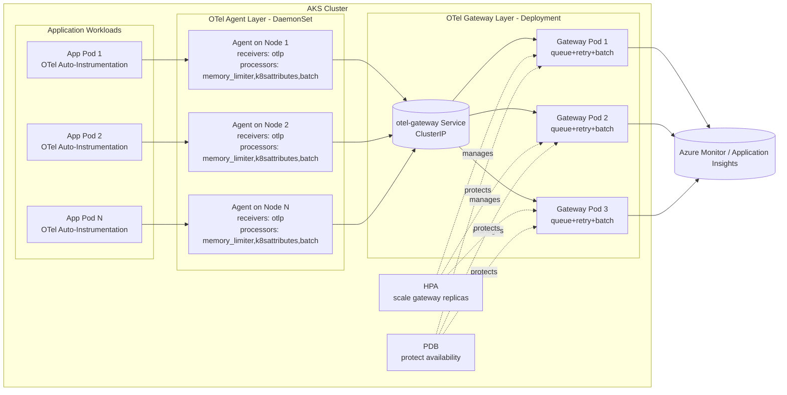
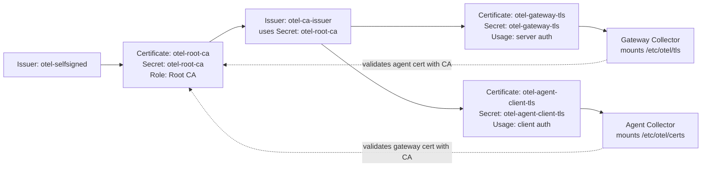

# OTel 生产部署

[中文首页](../README.md) | [English Home](../README.en.md) | [English Doc](README.prod.en.md)

## 文件清单

- networkpolicy.prod.yaml：生产网络策略（默认拒绝 + 必要放通）。
- collector-tls.prod.yaml：cert-manager 证书与 Issuer 资源（gateway/agent mTLS）。
- gateway-values.prod.yaml：gateway Collector Helm values（导出与扩展策略）。
- agent-values.prod.yaml：agent Collector Helm values（节点侧接入与转发）。
- otel-agent-service.prod.yaml：agent OTLP 稳定入口 Service（应用上报目标）。
- otel-agent-rbac.prod.yaml：agent 所需 RBAC（k8sattributes 读取权限）。
- inst-crd-dotnet.prod.yaml：生产 .NET 自动注入 Instrumentation CRD。
- inst-crd-python.prod.yaml：生产 Python 自动注入 Instrumentation CRD。
- otelapidemo-dotnet.yaml：生产 .NET 示例应用清单（已内置生产注解）。
- otelapidemo-python.yaml：生产 Python 示例清单模板（已内置生产注解，当前仅示例用途，尚需进一步测试）。
- alerts-kql.prod.md：生产告警与 KQL 建议。
- version-baseline.current.md：生产版本基线台账与变更记录。
- README.prod.md：当前中文生产部署说明。
- README.prod.en.md：英文生产部署说明。

## 前置条件

1. 已具备 AKS 集群访问权限，并已正确配置 `kubectl` 与 `helm`。
2. 集群中 `cert-manager` 已安装且状态正常。
3. 必要命名空间已存在（`observability`、`apps-prod`），且应用命名空间已标记 `otel-client=true`。
4. `observability` 命名空间中已存在 App Insights 连接串密钥（`appinsights-conn`）。
5. RBAC 权限允许在 `observability` 命名空间读取并更新 release。

## 部署顺序

1. 标记客户端命名空间并应用 NetworkPolicy。
2. 创建或更新 Application Insights 连接串密钥。
3. 应用 cert-manager TLS 清单，生成 gateway 与 agent 证书。
4. 部署 gateway collector（Deployment，多副本）。
5. 部署 agent collector（DaemonSet）。
6. 应用 agent Service 清单（为应用提供稳定 OTLP 入口）。
7. 应用 agent 的 RBAC 清单（k8sattributes 元数据提取权限）。
8. 应用 Instrumentation CRD。
9. 部署 otelapidemo 示例应用（优先 .NET；Python 清单当前仅示例用途，需先补充测试后再用于生产）。
10. 验证基础状态。

## 命令

```bash
# 1) 创建应用命名空间并放通 OTel 客户端流量
kubectl create namespace apps-prod --dry-run=client -o yaml | kubectl apply -f -
kubectl label namespace apps-prod otel-client=true --overwrite
kubectl apply -f ./prod/networkpolicy.prod.yaml

# 2) 创建密钥
kubectl create secret generic appinsights-conn \
  -n observability \
  --from-literal=connection_string="<APP_INSIGHTS_CONNECTION_STRING>" \
  --dry-run=client -o yaml | kubectl apply -f -

# 3) 通过 cert-manager 创建 TLS 证书与密钥
kubectl apply -f ./prod/collector-tls.prod.yaml

# 4) 部署 Gateway（release 名称：otel-gateway）
helm upgrade --install otel-gateway open-telemetry/opentelemetry-collector \
  --version 0.162.0 \
  -n observability --create-namespace \
  -f ./prod/gateway-values.prod.yaml

# 5) 部署 Agent（release 名称：otel-agent）
helm upgrade --install otel-agent open-telemetry/opentelemetry-collector \
  --version 0.162.0 \
  -n observability --create-namespace \
  -f ./prod/agent-values.prod.yaml

# 6) 应用 agent Service（稳定 OTLP 入口）
kubectl apply -f ./prod/otel-agent-service.prod.yaml

# 7) 应用 agent RBAC（k8sattributes 权限）
kubectl apply -f ./prod/otel-agent-rbac.prod.yaml

# 8) 应用 Instrumentation
kubectl apply -f ./prod/inst-crd-dotnet.prod.yaml
kubectl apply -f ./prod/inst-crd-python.prod.yaml

# 9) 部署 otelapidemo 示例应用（prod 清单）
kubectl apply -n apps-prod -f ./prod/otelapidemo-dotnet.yaml
# 可选：Python 清单当前仅示例用途，建议在测试通过后再启用
# kubectl apply -n apps-prod -f ./prod/otelapidemo-python.yaml

# 10) 验证
kubectl get pods -n observability
kubectl get deploy,ds -n observability
kubectl get svc -n observability otel-agent-opentelemetry-collector
kubectl get certificate -n observability
kubectl get pods -n apps-prod
```

## 命令（PowerShell）

```powershell
# 1) 创建应用命名空间并放通 OTel 客户端流量
kubectl create namespace apps-prod --dry-run=client -o yaml | kubectl apply -f -
kubectl label namespace apps-prod otel-client=true --overwrite
kubectl apply -f ./prod/networkpolicy.prod.yaml

# 2) 创建密钥
kubectl create secret generic appinsights-conn `
  -n observability `
  --from-literal=connection_string="<APP_INSIGHTS_CONNECTION_STRING>" `
  --dry-run=client -o yaml | kubectl apply -f -

# 3) 通过 cert-manager 创建 TLS 证书与密钥
kubectl apply -f ./prod/collector-tls.prod.yaml

# 4) 部署 Gateway（release 名称：otel-gateway）
helm upgrade --install otel-gateway open-telemetry/opentelemetry-collector `
  --version 0.162.0 `
  -n observability --create-namespace `
  -f ./prod/gateway-values.prod.yaml

# 5) 部署 Agent（release 名称：otel-agent）
helm upgrade --install otel-agent open-telemetry/opentelemetry-collector `
  --version 0.162.0 `
  -n observability --create-namespace `
  -f ./prod/agent-values.prod.yaml

# 6) 应用 agent Service（稳定 OTLP 入口）
kubectl apply -f ./prod/otel-agent-service.prod.yaml

# 7) 应用 agent RBAC（k8sattributes 权限）
kubectl apply -f ./prod/otel-agent-rbac.prod.yaml

# 8) 应用 Instrumentation
kubectl apply -f ./prod/inst-crd-dotnet.prod.yaml
kubectl apply -f ./prod/inst-crd-python.prod.yaml

# 9) 部署 otelapidemo 示例应用（prod 清单）
kubectl apply -n apps-prod -f ./prod/otelapidemo-dotnet.yaml
# 可选：Python 清单当前仅示例用途，建议在测试通过后再启用
# kubectl apply -n apps-prod -f ./prod/otelapidemo-python.yaml

# 10) 验证
kubectl get pods -n observability
kubectl get deploy,ds -n observability
kubectl get svc -n observability otel-agent-opentelemetry-collector
kubectl get instrumentation -n observability
kubectl get certificate -n observability
kubectl get pods -n apps-prod

# 11) Collector 管道计数器（gateway）
$pod = kubectl get pods -n observability -l app.kubernetes.io/instance=otel-gateway -o jsonpath='{.items[0].metadata.name}'
kubectl get --raw "/api/v1/namespaces/observability/pods/${pod}:8888/proxy/metrics" |
  Select-String -Pattern "otelcol_receiver_accepted_spans|otelcol_exporter_sent_spans|otelcol_receiver_accepted_log_records|otelcol_exporter_sent_log_records|otelcol_receiver_accepted_metric_points|otelcol_exporter_sent_metric_points"

# 12) （可选）如你是从旧版 dev 清单迁移，才需要手工 patch 注解并重启
# 新的 ./prod/otelapidemo-*.yaml 已内置生产注解，无需执行该步骤
```

## 应用注解示例

```yaml
metadata:
  annotations:
    instrumentation.opentelemetry.io/inject-dotnet: "observability/dotnet-auto-prod"
```

```yaml
metadata:
  annotations:
    instrumentation.opentelemetry.io/inject-python: "observability/python-auto-prod"
```

## 说明

- 当前生产基线已关闭 debug exporter，仅保留 azuremonitor。
- 采样率设置为 10%（`0.1`），用于生产成本控制。
- 应用通过服务 DNS `otel-agent-opentelemetry-collector.observability.svc.cluster.local:4317` 上报到 agent，再由 agent 转发至 gateway。
- 相同的 agent/gateway 架构同样适用于 Python 负载；差异仅在 Instrumentation CRD 与应用注解。
- `otelapidemo-python.yaml` 目前仅作为示例模板，尚未完成完整生产验证，建议先在独立环境完成回归测试后再投产。
- 对 Python 来说，业务日志仍需应用主动输出；自动注入可开启 OTLP 日志导出，但不会自动产生日志内容。

## 排查步骤（访问应用后 AI 无数据）

1. 检查核心组件状态：`observability` 下 agent/gateway Pod 必须全部 `Running`。
2. 检查 OTLP 入口服务：`otel-agent-opentelemetry-collector` 必须存在且有 Endpoints。
3. 检查自动注入：应用 Pod 注解应为 `observability/dotnet-auto-prod`，并存在 `opentelemetry-auto-instrumentation-dotnet` initContainer。
4. 检查 Instrumentation：`dotnet-auto-prod` 的 endpoint/sampler 配置正确，且 sampler 与预期一致。
5. 发送测试流量：对业务接口连续压测 50-200 次，避免低采样率下偶发“全空”。
6. 检查 Collector 自监控：查看 agent/gateway 的 exporter queue 与 error 日志。
7. 验证 App Insights：先用无过滤 KQL 看近 30-60 分钟总量，再按 `cloud_RoleName` 或 `service.name` 过滤。

### App Insights 最终核验 KQL（30 分钟）

- 在发送测试流量、重启 Pod、或调整 Collector/Instrumentation 配置后，建议先等待 3-10 分钟再查询，以避免摄取延迟导致误判。

```kql
union requests, dependencies, traces
| where timestamp > ago(30m)
| where cloud_RoleName =~ "otelapidemo"
  or tostring(customDimensions["service.name"]) =~ "otelapidemo"
| order by timestamp desc
```

### 快速排查脚本（PowerShell）

```powershell
$nsObs = "observability"
$nsApp = "apps-prod"
$app = "otelapidemo"
$svc = "otel-agent-opentelemetry-collector"

Write-Host "== 1) 组件状态 =="
kubectl get pods -n $nsObs -o wide
kubectl get pods -n $nsApp -l app=$app -o wide

Write-Host "== 2) OTLP 入口服务 =="
kubectl get svc -n $nsObs $svc -o wide
kubectl get endpoints -n $nsObs $svc -o wide

Write-Host "== 3) Instrumentation 与应用注解 =="
kubectl get instrumentation -n $nsObs dotnet-auto-prod -o yaml
kubectl get deploy -n $nsApp $app -o jsonpath='{.spec.template.metadata.annotations.instrumentation\.opentelemetry\.io/inject-dotnet}{"`n"}'

Write-Host "== 4) 打测试流量 =="
$lb = kubectl get svc -n $nsApp $app -o jsonpath='{.status.loadBalancer.ingress[0].ip}'
if ([string]::IsNullOrEmpty($lb)) {
  Write-Host "LoadBalancer IP not ready"
} else {
  1..100 | ForEach-Object {
    try { Invoke-WebRequest -Uri ("http://{0}/weatherforecast" -f $lb) -UseBasicParsing -TimeoutSec 5 | Out-Null } catch {}
  }
  Write-Host "Traffic sent to http://$lb/weatherforecast"
}

Write-Host "== 5) Collector 关键日志（近10分钟） =="
kubectl logs -n $nsObs -l app.kubernetes.io/instance=otel-agent --since=10m | Select-String -Pattern "forbidden|error|failed|otlp|gateway" 
kubectl logs -n $nsObs -l app.kubernetes.io/instance=otel-gateway --since=10m | Select-String -Pattern "error|failed|azuremonitor|export|401|403|404|429|5[0-9][0-9]"
```

### 快速排查脚本（bash）

```bash
set -euo pipefail

NS_OBS="observability"
NS_APP="apps-prod"
APP="otelapidemo"
SVC="otel-agent-opentelemetry-collector"

echo "== 1) 组件状态 =="
kubectl get pods -n "$NS_OBS" -o wide
kubectl get pods -n "$NS_APP" -l app="$APP" -o wide

echo "== 2) OTLP 入口服务 =="
kubectl get svc -n "$NS_OBS" "$SVC" -o wide
kubectl get endpoints -n "$NS_OBS" "$SVC" -o wide

echo "== 3) Instrumentation 与应用注解 =="
kubectl get instrumentation -n "$NS_OBS" dotnet-auto-prod -o yaml
kubectl get deploy -n "$NS_APP" "$APP" -o jsonpath='{.spec.template.metadata.annotations.instrumentation\.opentelemetry\.io/inject-dotnet}{"\n"}'

echo "== 4) 打测试流量 =="
LB_IP=$(kubectl get svc -n "$NS_APP" "$APP" -o jsonpath='{.status.loadBalancer.ingress[0].ip}')
if [ -n "${LB_IP}" ]; then
  for i in $(seq 1 100); do
    curl -sS "http://${LB_IP}/weatherforecast" >/dev/null || true
  done
  echo "Traffic sent to http://${LB_IP}/weatherforecast"
else
  echo "LoadBalancer IP not ready"
fi

echo "== 5) Collector 关键日志（近10分钟） =="
kubectl logs -n "$NS_OBS" -l app.kubernetes.io/instance=otel-agent --since=10m | egrep -i "forbidden|error|failed|otlp|gateway" || true
kubectl logs -n "$NS_OBS" -l app.kubernetes.io/instance=otel-gateway --since=10m | egrep -i "error|failed|azuremonitor|export|401|403|404|429|5[0-9][0-9]" || true
```

## Collector 架构（生产）



## 证书关系



## Collector 告警阈值建议

1. `otelcol_exporter_send_failed_* > 0` 持续 5 分钟：Sev2。
2. `otelcol_receiver_refused_* > 0` 持续 5 分钟：Sev2。
3. accepted 与 sent 计数器差值持续增长 10 分钟：Sev2。
4. exporter 队列使用率 > 70% 持续 10 分钟：Sev3。
5. exporter 队列使用率 > 90% 持续 5 分钟：Sev2。
6. Collector Pod 在 10 分钟内重启 >= 2 次：Sev2。
7. HPA 长时间（15 分钟以上）处于最大副本：Sev3（容量预警）。
8. 导出延迟 P95 > 5 秒持续 10 分钟：Sev3。

## 升级前检查（Upgrade Pre-Checks）

在执行任何 OTel 升级前，请先固化当前状态，确保回滚可确定执行。

0. 开始升级前，先在 `./prod/version-baseline.current.md` 更新当前测试软件版本（chart/image/operator/cert-manager/k8s/helm）。

1. 导出当前 release values（即第 2 项所需基线数据）：将集群当前生效配置保存为回滚基线。

```bash
mkdir -p ./prod/upgrade-baseline
helm get values otel-gateway -n observability -o yaml > ./prod/upgrade-baseline/otel-gateway.values.current.yaml
helm get values otel-agent -n observability -o yaml > ./prod/upgrade-baseline/otel-agent.values.current.yaml
```

```powershell
New-Item -ItemType Directory -Force -Path ./prod/upgrade-baseline | Out-Null
helm get values otel-gateway -n observability -o yaml | Out-File -Encoding utf8 ./prod/upgrade-baseline/otel-gateway.values.current.yaml
helm get values otel-agent -n observability -o yaml | Out-File -Encoding utf8 ./prod/upgrade-baseline/otel-agent.values.current.yaml
```

2. 记录当前 chart 版本 / 镜像 tag / operator 版本（第 3 项）。

```bash
# Chart 版本
helm list -n observability | grep -E 'otel-gateway|otel-agent'

# 当前运行的 Collector 镜像 tag
kubectl get deploy -n observability otel-gateway-opentelemetry-collector -o jsonpath='{.spec.template.spec.containers[0].image}{"\n"}'
kubectl get ds -n observability otel-agent-opentelemetry-collector -o jsonpath='{.spec.template.spec.containers[0].image}{"\n"}'

# Operator 版本（deployment 镜像）
kubectl get deploy -n opentelemetry-operator-system opentelemetry-operator -o jsonpath='{.spec.template.spec.containers[0].image}{"\n"}'
```

```powershell
# Chart 版本
helm list -n observability | Select-String -Pattern 'otel-gateway|otel-agent'

# 当前运行的 Collector 镜像 tag
kubectl get deploy -n observability otel-gateway-opentelemetry-collector -o jsonpath='{.spec.template.spec.containers[0].image}{"`n"}'
kubectl get ds -n observability otel-agent-opentelemetry-collector -o jsonpath='{.spec.template.spec.containers[0].image}{"`n"}'

# Operator 版本（deployment 镜像）
kubectl get deploy -n opentelemetry-operator-system opentelemetry-operator -o jsonpath='{.spec.template.spec.containers[0].image}{"`n"}'
```

3. 升级前执行一次基线验证：包括 traces、metrics、logs 管道计数器、App Insights 入库、collector 自监控指标，以及 HPA/PDB 状态。

